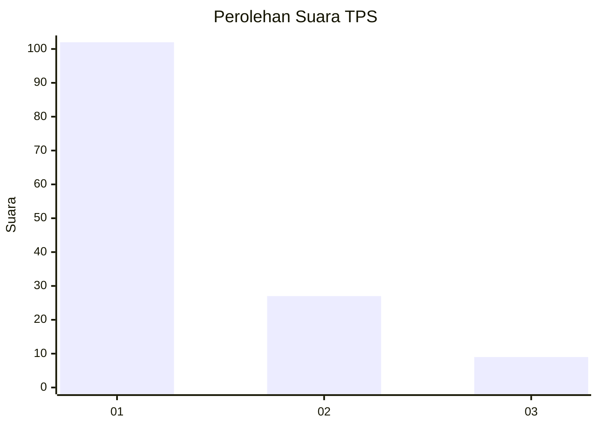
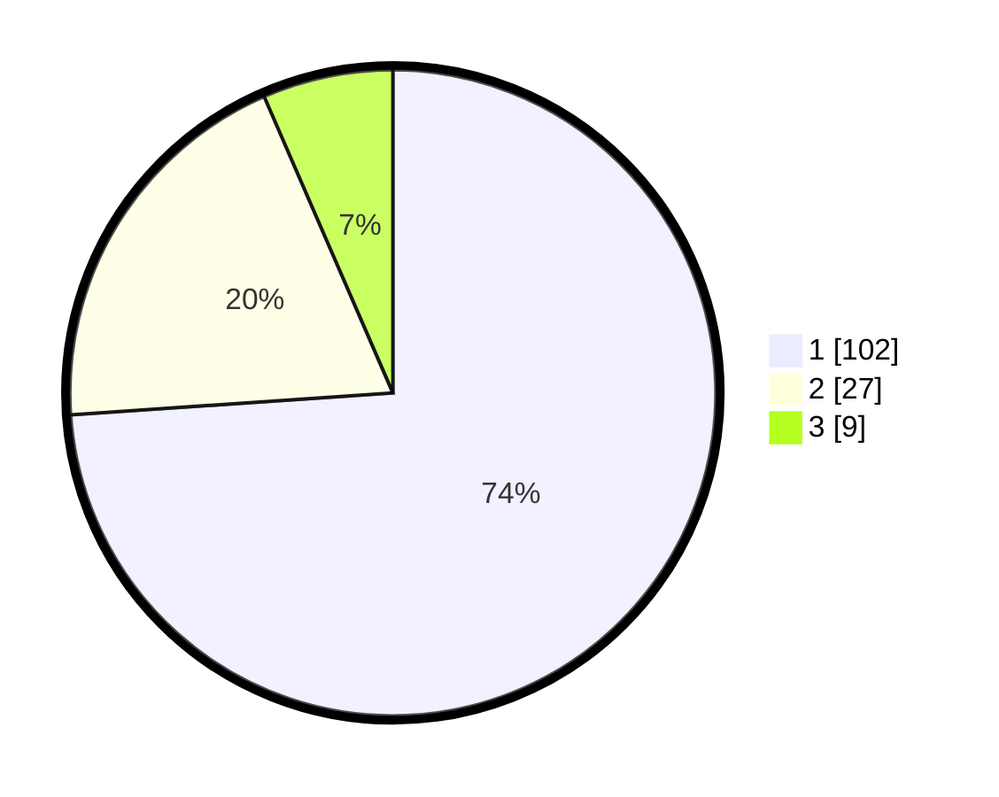

# Hasil

## Grafik

## Tabel

| No. | Nama Paslon    | Suara | Suara (raw) | Persentase |
|:--- |:-------------- | -----:| -----------:| ----------:|
| 1   | ANIES MUHAIMIN | 102   | [102][p-1]  | 73,91      |
| 2   | PRABOWO GIBRAN | 27    | [27][p-2]   | 19,57      |
| 3   | GANJAR MAHFUD  | 9     | [9][p-3]    | 6,52       |

[p-1]: https://github.com/gigit-pemilu/pemilu-2024-82-maluku-utara/blob/main/pilpres/hitung-suara/sub/82-maluku-utara/sub/01-halmahera-barat/sub/01-jailolo/sub/2002-guaimaadu/sub/001-tps/sub/paslon-1.txt
[p-2]: https://github.com/gigit-pemilu/pemilu-2024-82-maluku-utara/blob/main/pilpres/hitung-suara/sub/82-maluku-utara/sub/01-halmahera-barat/sub/01-jailolo/sub/2002-guaimaadu/sub/001-tps/sub/paslon-2.txt
[p-3]: https://github.com/gigit-pemilu/pemilu-2024-82-maluku-utara/blob/main/pilpres/hitung-suara/sub/82-maluku-utara/sub/01-halmahera-barat/sub/01-jailolo/sub/2002-guaimaadu/sub/001-tps/sub/paslon-3.txt

## Foto C Plano

https://sirekap-obj-formc.kpu.go.id/3755/pemilu/ppwp/82/01/01/20/02/8201012002001-20240225-004125--ce43cd31-1600-4f09-b500-d34a7eb88390.jpg

https://sirekap-obj-formc.kpu.go.id/3755/pemilu/ppwp/82/01/01/20/02/8201012002001-20240225-004127--9433a11e-b2dd-4460-80b1-15213616369f.jpg

https://sirekap-obj-formc.kpu.go.id/3755/pemilu/ppwp/82/01/01/20/02/8201012002001-20240225-004126--9f6c261a-07ca-41e3-9ebb-38584800a61c.jpg

## Metadata

| Key        | Value               |
| ---------- | ------------------- |
| Time Stamp | 2024-02-25 14:00:00 |

## DATA PEMILIH TETAP

Jumlah pemilih dalam DPT: **287**.
 * L: **139**.
 * P: **148**.

## DATA PENGGUNA HAK PILIH

Jumlah pengguna hak pilih dalam DPT: **232**.
 * L: **114**.
 * P: **118**.

Jumlah pengguna hak pilih dalam DPTb: **5**.
 * L: **3**.
 * P: **2**.

Jumlah pengguna hak pilih dalam DPK: **15**.
 * L: **6**.
 * P: **9**.

Jumlah pengguna hak pilih: **252**.
 * L: **123**.
 * P: **129**.

## JUMLAH SUARA SAH DAN TIDAK SAH

JUMLAH SELURUH SUARA SAH: **239**.

JUMLAH SUARA TIDAK SAH: **13**.

JUMLAH SELURUH SUARA SAH DAN SUARA TIDAK SAH: **252**.

