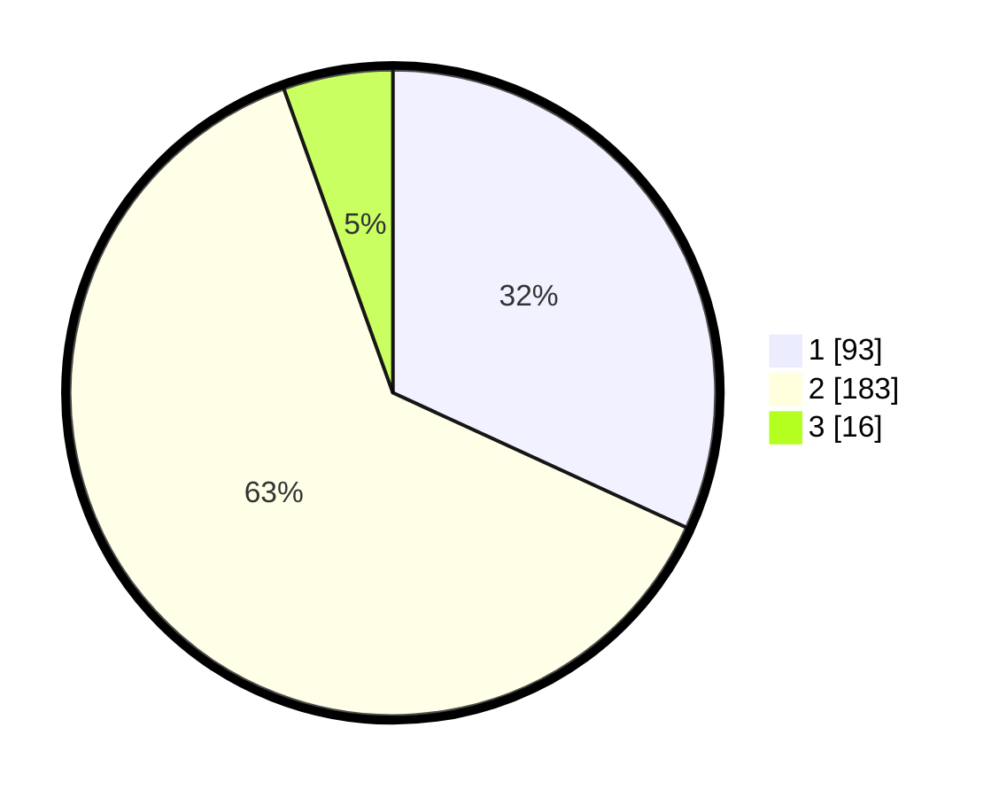

# Hasil

## Grafik

## Tabel

| No. | Nama Paslon    | Suara | Suara (raw) | Persentase |
|:--- |:-------------- | -----:| -----------:| ----------:|
| 1   | ANIES MUHAIMIN | 93    | [93][p-1]   | 31,85      |
| 2   | PRABOWO GIBRAN | 183   | [183][p-2]  | 62,67      |
| 3   | GANJAR MAHFUD  | 16    | [16][p-3]   | 5,48       |

[p-1]: https://github.com/gigit-pemilu/pemilu-2024-82-maluku-utara/blob/main/pilpres/hitung-suara/sub/82-maluku-utara/sub/01-halmahera-barat/sub/01-jailolo/sub/2002-guaimaadu/sub/002-tps/sub/paslon-1.txt
[p-2]: https://github.com/gigit-pemilu/pemilu-2024-82-maluku-utara/blob/main/pilpres/hitung-suara/sub/82-maluku-utara/sub/01-halmahera-barat/sub/01-jailolo/sub/2002-guaimaadu/sub/002-tps/sub/paslon-2.txt
[p-3]: https://github.com/gigit-pemilu/pemilu-2024-82-maluku-utara/blob/main/pilpres/hitung-suara/sub/82-maluku-utara/sub/01-halmahera-barat/sub/01-jailolo/sub/2002-guaimaadu/sub/002-tps/sub/paslon-3.txt

## Foto C Plano

https://sirekap-obj-formc.kpu.go.id/e37b/pemilu/ppwp/82/01/01/20/02/8201012002002-20240226-135020--2ea055a9-aa8b-4237-8a6a-1a7b2641c1b8.jpg

https://sirekap-obj-formc.kpu.go.id/e37b/pemilu/ppwp/82/01/01/20/02/8201012002002-20240226-135021--78ab193a-ef6e-44d2-873c-e2d675e6980f.jpg

https://sirekap-obj-formc.kpu.go.id/e37b/pemilu/ppwp/82/01/01/20/02/8201012002002-20240226-135020--51ce1d72-70da-4c90-ad32-51c41c278769.jpg

## Metadata

| Key        | Value               |
| ---------- | ------------------- |
| Time Stamp | 2024-02-26 15:00:00 |

## DATA PEMILIH TETAP

Jumlah pemilih dalam DPT: **290**.
 * L: **152**.
 * P: **138**.

## DATA PENGGUNA HAK PILIH

Jumlah pengguna hak pilih dalam DPT: **286**.
 * L: **150**.
 * P: **136**.

Jumlah pengguna hak pilih dalam DPTb: **5**.
 * L: **5**.
 * P: **0**.

Jumlah pengguna hak pilih dalam DPK: **1**.
 * L: **0**.
 * P: **1**.

Jumlah pengguna hak pilih: **292**.
 * L: **155**.
 * P: **137**.

## JUMLAH SUARA SAH DAN TIDAK SAH

JUMLAH SELURUH SUARA SAH: **292**.

JUMLAH SUARA TIDAK SAH: **4**.

JUMLAH SELURUH SUARA SAH DAN SUARA TIDAK SAH: **296**.

