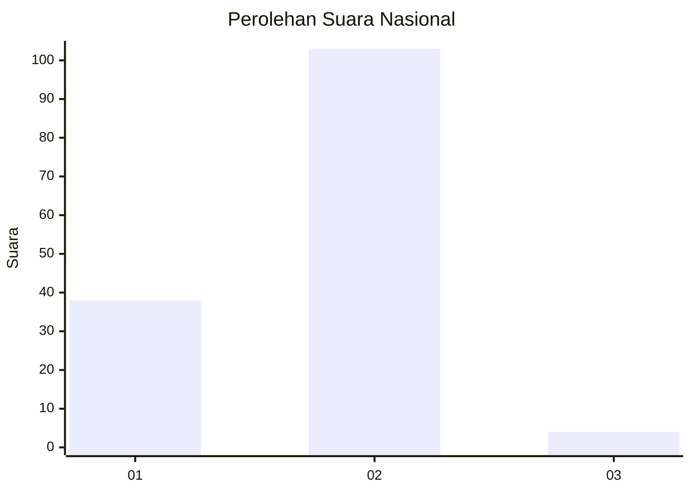
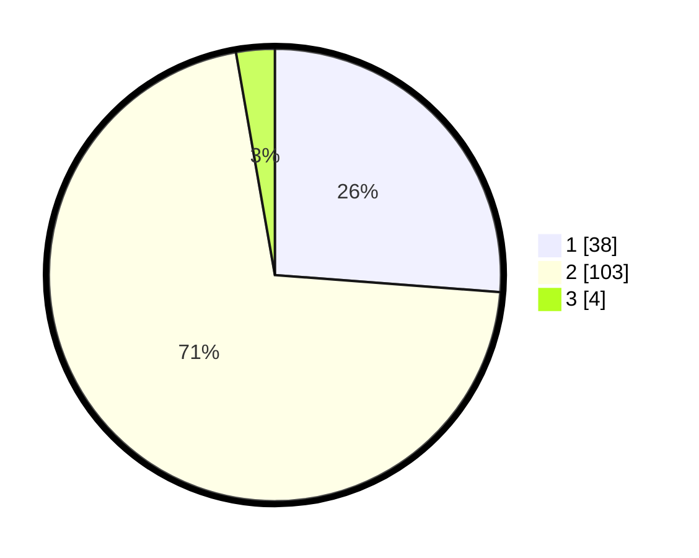

# Hasil

## Grafik

## Tabel

| No. | Nama Paslon    | Suara | Suara (raw) | Persentase |
|:--- |:-------------- | -----:| -----------:| ----------:|
| 1   | ANIES MUHAIMIN | 38    | [38][p-1]   | 26,21      |
| 2   | PRABOWO GIBRAN | 103   | [103][p-2]  | 71,03      |
| 3   | GANJAR MAHFUD  | 4     | [4][p-3]    | 2,76       |

[p-1]: https://github.com/gigit-pemilu/pemilu-2024/blob/main/pilpres/hitung-suara/sub/82-maluku-utara/sub/02-halmahera-tengah/sub/07-weda-tengah/sub/2001-lililef-waibulan/sub/005-tps/sub/paslon-1.txt
[p-2]: https://github.com/gigit-pemilu/pemilu-2024/blob/main/pilpres/hitung-suara/sub/82-maluku-utara/sub/02-halmahera-tengah/sub/07-weda-tengah/sub/2001-lililef-waibulan/sub/005-tps/sub/paslon-2.txt
[p-3]: https://github.com/gigit-pemilu/pemilu-2024/blob/main/pilpres/hitung-suara/sub/82-maluku-utara/sub/02-halmahera-tengah/sub/07-weda-tengah/sub/2001-lililef-waibulan/sub/005-tps/sub/paslon-3.txt

## Foto C Plano

https://sirekap-obj-formc.kpu.go.id/12b5/pemilu/ppwp/82/02/07/20/01/8202072001005-20240223-194106--f1edbc34-82a2-4e64-948f-262553a09119.jpg

https://sirekap-obj-formc.kpu.go.id/12b5/pemilu/ppwp/82/02/07/20/01/8202072001005-20240223-194118--b1bd26d3-b6dc-4cd6-8da7-ad23392c6fcc.jpg

https://sirekap-obj-formc.kpu.go.id/12b5/pemilu/ppwp/82/02/07/20/01/8202072001005-20240223-194137--4508f353-7546-4bd8-a005-a8ef71336051.jpg

## Metadata

| Key        | Value               |
| ---------- | ------------------- |
| Time Stamp | 2024-02-24 22:31:28 |

