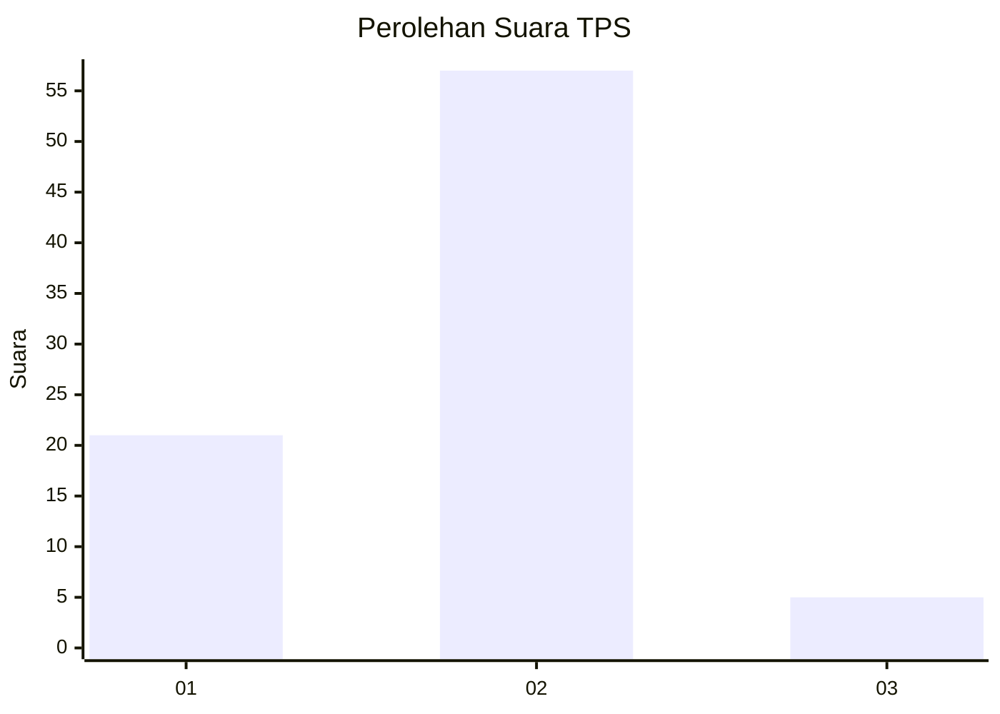
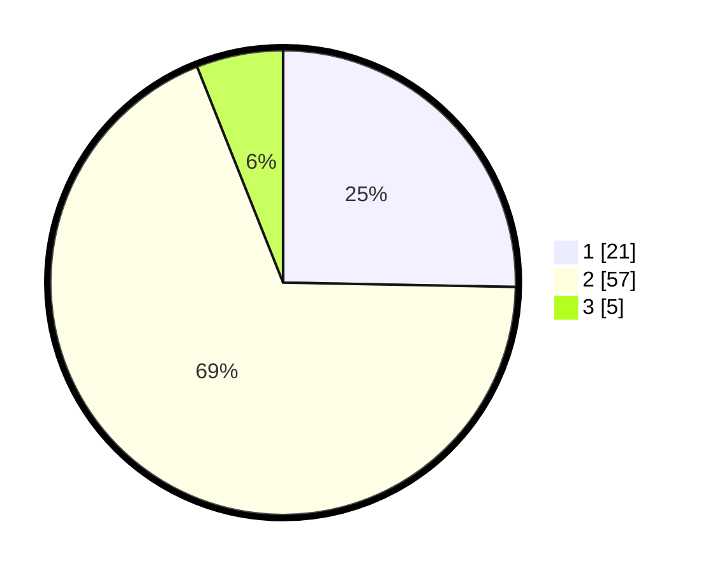

# Hasil

## Grafik

## Tabel

| No. | Nama Paslon    | Suara | Suara (raw) | Persentase |
|:--- |:-------------- | -----:| -----------:| ----------:|
| 1   | ANIES MUHAIMIN | 21    | [21][p-1]   | 25,30      |
| 2   | PRABOWO GIBRAN | 57    | [57][p-2]   | 68,67      |
| 3   | GANJAR MAHFUD  | 5     | [5][p-3]    | 6,02       |

[p-1]: https://github.com/gigit-pemilu/pemilu-2024-82-maluku-utara/blob/main/pilpres/hitung-suara/sub/82-maluku-utara/sub/02-halmahera-tengah/sub/07-weda-tengah/sub/2001-lililef-waibulan/sub/013-tps/sub/paslon-1.txt
[p-2]: https://github.com/gigit-pemilu/pemilu-2024-82-maluku-utara/blob/main/pilpres/hitung-suara/sub/82-maluku-utara/sub/02-halmahera-tengah/sub/07-weda-tengah/sub/2001-lililef-waibulan/sub/013-tps/sub/paslon-2.txt
[p-3]: https://github.com/gigit-pemilu/pemilu-2024-82-maluku-utara/blob/main/pilpres/hitung-suara/sub/82-maluku-utara/sub/02-halmahera-tengah/sub/07-weda-tengah/sub/2001-lililef-waibulan/sub/013-tps/sub/paslon-3.txt

## Foto C Plano

https://sirekap-obj-formc.kpu.go.id/d03c/pemilu/ppwp/82/02/07/20/01/8202072001013-20240214-200440--374a6c3a-0a95-4ef6-bc36-664f2da45067.jpg

https://sirekap-obj-formc.kpu.go.id/d03c/pemilu/ppwp/82/02/07/20/01/8202072001013-20240214-201154--94cbeb67-8db4-48f9-911b-db72ca1df5f5.jpg

https://sirekap-obj-formc.kpu.go.id/d03c/pemilu/ppwp/82/02/07/20/01/8202072001013-20240214-200515--679fa178-5639-4a6a-aea0-3a6543e263dc.jpg

## Metadata

| Key        | Value               |
| ---------- | ------------------- |
| Time Stamp | 2024-02-16 16:25:10 |

