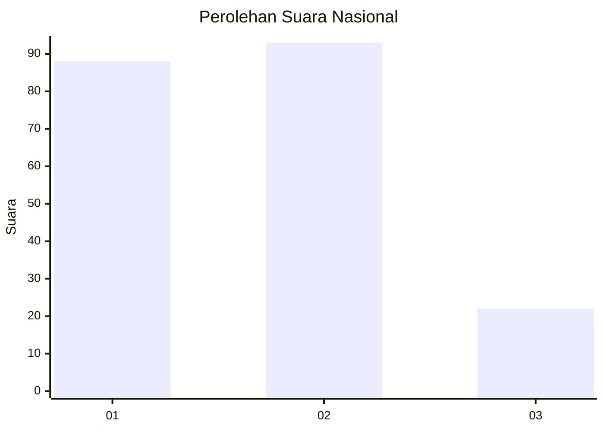
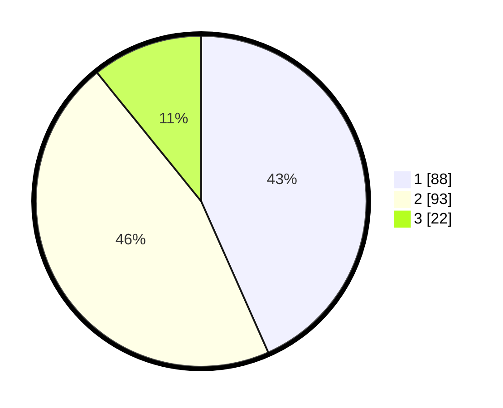

# Hasil

## Grafik

## Tabel

| No. | Nama Paslon    | Suara | Suara (raw) | Persentase |
|:--- |:-------------- | -----:| -----------:| ----------:|
| 1   | ANIES MUHAIMIN | 88    | [88][p-1]   | 43,35      |
| 2   | PRABOWO GIBRAN | 93    | [93][p-2]   | 45,81      |
| 3   | GANJAR MAHFUD  | 22    | [22][p-3]   | 10,84      |

[p-1]: https://github.com/gigit-pemilu/pemilu-2024/blob/main/pilpres/hitung-suara/sub/82-maluku-utara/sub/02-halmahera-tengah/sub/09-weda-timur/sub/2002-messa/sub/002-tps/sub/paslon-1.txt
[p-2]: https://github.com/gigit-pemilu/pemilu-2024/blob/main/pilpres/hitung-suara/sub/82-maluku-utara/sub/02-halmahera-tengah/sub/09-weda-timur/sub/2002-messa/sub/002-tps/sub/paslon-2.txt
[p-3]: https://github.com/gigit-pemilu/pemilu-2024/blob/main/pilpres/hitung-suara/sub/82-maluku-utara/sub/02-halmahera-tengah/sub/09-weda-timur/sub/2002-messa/sub/002-tps/sub/paslon-3.txt

## Foto C Plano

https://sirekap-obj-formc.kpu.go.id/bb59/pemilu/ppwp/82/02/09/20/02/8202092002002-20240223-121436--48478da5-0d75-44f9-b165-c7059fdf6c46.jpg

https://sirekap-obj-formc.kpu.go.id/bb59/pemilu/ppwp/82/02/09/20/02/8202092002002-20240223-121447--05b6d766-8eb2-4da2-8747-522efef1debf.jpg

https://sirekap-obj-formc.kpu.go.id/bb59/pemilu/ppwp/82/02/09/20/02/8202092002002-20240223-121457--0bf484d3-6a43-4c77-8b97-f86d40b92a80.jpg

## Metadata

| Key        | Value               |
| ---------- | ------------------- |
| Time Stamp | 2024-02-24 22:31:28 |

