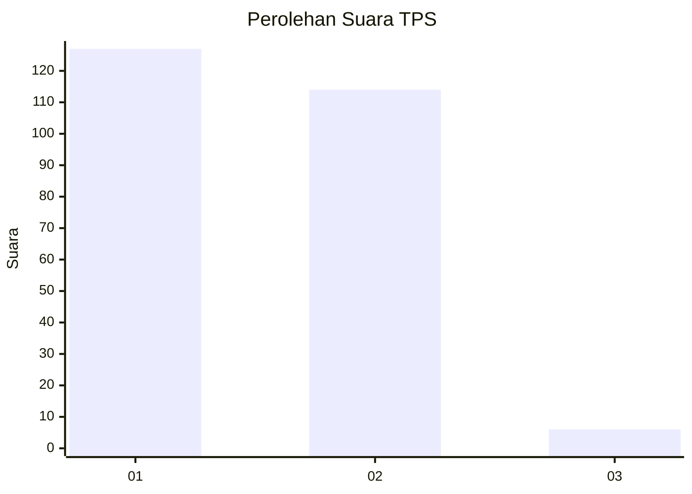
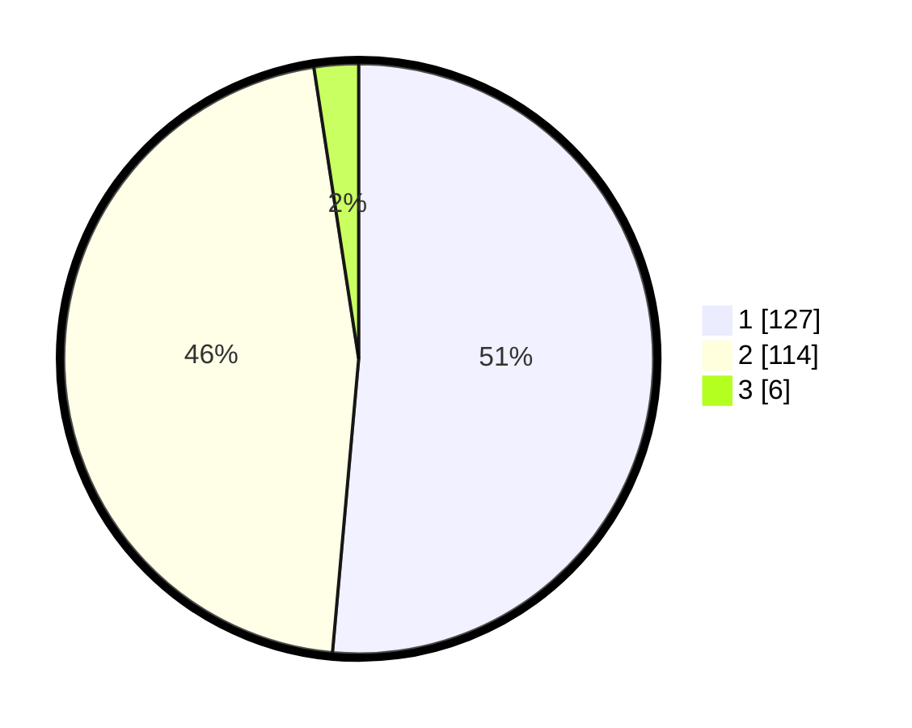

# Hasil

## Grafik

## Tabel

| No. | Nama Paslon    | Suara | Suara (raw) | Persentase |
|:--- |:-------------- | -----:| -----------:| ----------:|
| 1   | ANIES MUHAIMIN | 127   | [127][p-1]  | 51,42      |
| 2   | PRABOWO GIBRAN | 114   | [114][p-2]  | 46,15      |
| 3   | GANJAR MAHFUD  | 6     | [6][p-3]    | 2,43       |

[p-1]: https://github.com/gigit-pemilu/pemilu-2024-82-maluku-utara/blob/main/pilpres/hitung-suara/sub/82-maluku-utara/sub/03-halmahera-utara/sub/04-galela/sub/2001-soa-sio/sub/001-tps/sub/paslon-1.txt
[p-2]: https://github.com/gigit-pemilu/pemilu-2024-82-maluku-utara/blob/main/pilpres/hitung-suara/sub/82-maluku-utara/sub/03-halmahera-utara/sub/04-galela/sub/2001-soa-sio/sub/001-tps/sub/paslon-2.txt
[p-3]: https://github.com/gigit-pemilu/pemilu-2024-82-maluku-utara/blob/main/pilpres/hitung-suara/sub/82-maluku-utara/sub/03-halmahera-utara/sub/04-galela/sub/2001-soa-sio/sub/001-tps/sub/paslon-3.txt

## Foto C Plano

https://sirekap-obj-formc.kpu.go.id/7fdf/pemilu/ppwp/82/03/04/20/01/8203042001001-20240215-144346--f3745dd4-e514-46e0-9534-47fda2a52839.jpg

https://sirekap-obj-formc.kpu.go.id/7fdf/pemilu/ppwp/82/03/04/20/01/8203042001001-20240215-145130--033c204b-71f9-45d5-bfd0-d3629025201a.jpg

https://sirekap-obj-formc.kpu.go.id/7fdf/pemilu/ppwp/82/03/04/20/01/8203042001001-20240219-101516--787af891-94ff-421e-a720-72311cefcc6b.jpg

## Metadata

| Key        | Value               |
| ---------- | ------------------- |
| Time Stamp | 2024-02-22 16:00:00 |

