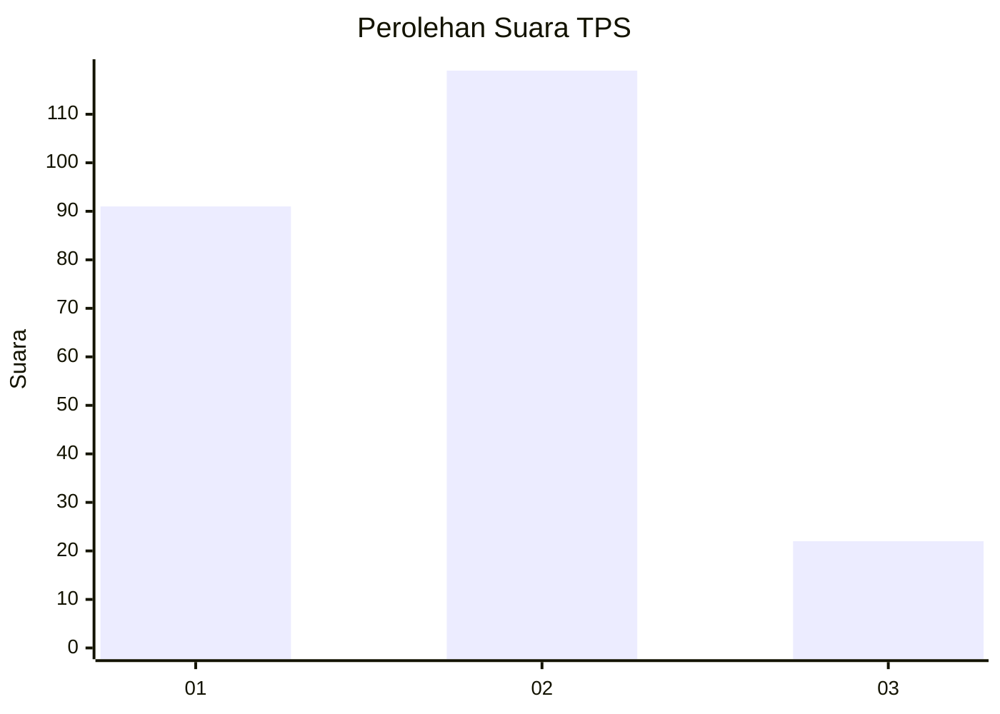
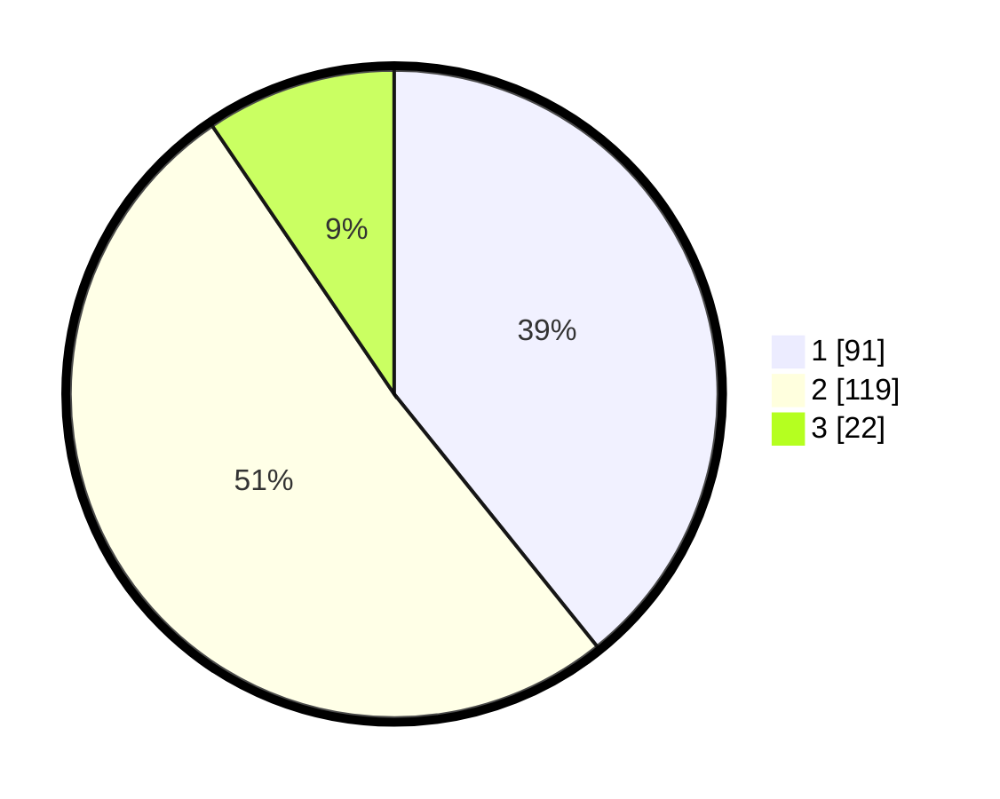

# Hasil

## Grafik

## Tabel

| No. | Nama Paslon    | Suara | Suara (raw) | Persentase |
|:--- |:-------------- | -----:| -----------:| ----------:|
| 1   | ANIES MUHAIMIN | 91    | [91][p-1]   | 39,22      |
| 2   | PRABOWO GIBRAN | 119   | [119][p-2]  | 51,29      |
| 3   | GANJAR MAHFUD  | 22    | [22][p-3]   | 9,48       |

[p-1]: https://github.com/gigit-pemilu/pemilu-2024-82-maluku-utara/blob/main/pilpres/hitung-suara/sub/82-maluku-utara/sub/03-halmahera-utara/sub/08-malifut/sub/2003-samsuma/sub/001-tps/sub/paslon-1.txt
[p-2]: https://github.com/gigit-pemilu/pemilu-2024-82-maluku-utara/blob/main/pilpres/hitung-suara/sub/82-maluku-utara/sub/03-halmahera-utara/sub/08-malifut/sub/2003-samsuma/sub/001-tps/sub/paslon-2.txt
[p-3]: https://github.com/gigit-pemilu/pemilu-2024-82-maluku-utara/blob/main/pilpres/hitung-suara/sub/82-maluku-utara/sub/03-halmahera-utara/sub/08-malifut/sub/2003-samsuma/sub/001-tps/sub/paslon-3.txt

## Foto C Plano

https://sirekap-obj-formc.kpu.go.id/2de8/pemilu/ppwp/82/03/08/20/03/8203082003001-20240215-113806--48d123b9-a010-4ccf-8ca7-a13cbd88a72e.jpg

https://sirekap-obj-formc.kpu.go.id/2de8/pemilu/ppwp/82/03/08/20/03/8203082003001-20240215-004408--0db6b874-197f-4b03-b566-0058da948e88.jpg

https://sirekap-obj-formc.kpu.go.id/2de8/pemilu/ppwp/82/03/08/20/03/8203082003001-20240215-153659--4c2d54e6-5b4b-4ece-8e29-895fbcaf2fee.jpg

## Metadata

| Key        | Value               |
| ---------- | ------------------- |
| Time Stamp | 2024-02-15 21:01:18 |

