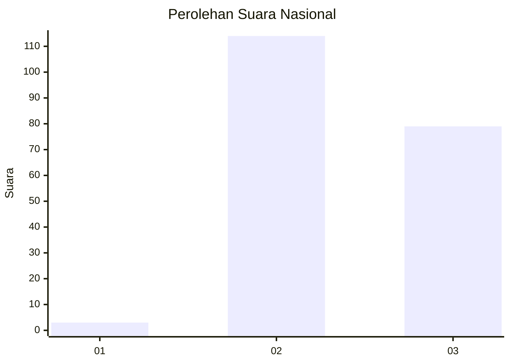
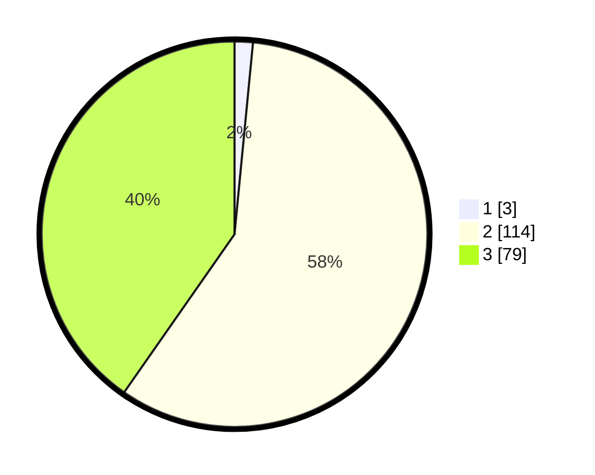

# Hasil

## Grafik

## Tabel

| No. | Nama Paslon    | Suara | Suara (raw) | Persentase |
|:--- |:-------------- | -----:| -----------:| ----------:|
| 1   | ANIES MUHAIMIN | 3     | [3][p-1]    | 1,53       |
| 2   | PRABOWO GIBRAN | 114   | [114][p-2]  | 58,16      |
| 3   | GANJAR MAHFUD  | 79    | [79][p-3]   | 40,31      |

[p-1]: https://github.com/gigit-pemilu/pemilu-2024/blob/main/pilpres/hitung-suara/sub/82-maluku-utara/sub/03-halmahera-utara/sub/09-loloda-utara/sub/2001-dorume/sub/002-tps/sub/paslon-1.txt
[p-2]: https://github.com/gigit-pemilu/pemilu-2024/blob/main/pilpres/hitung-suara/sub/82-maluku-utara/sub/03-halmahera-utara/sub/09-loloda-utara/sub/2001-dorume/sub/002-tps/sub/paslon-2.txt
[p-3]: https://github.com/gigit-pemilu/pemilu-2024/blob/main/pilpres/hitung-suara/sub/82-maluku-utara/sub/03-halmahera-utara/sub/09-loloda-utara/sub/2001-dorume/sub/002-tps/sub/paslon-3.txt

## Foto C Plano

https://sirekap-obj-formc.kpu.go.id/f4e1/pemilu/ppwp/82/03/09/20/01/8203092001002-20240222-145511--4dd33898-a46c-45e3-b374-c7702bd15b4e.jpg

https://sirekap-obj-formc.kpu.go.id/f4e1/pemilu/ppwp/82/03/09/20/01/8203092001002-20240222-145347--ec772745-33e2-4801-b15d-7d82de982649.jpg

https://sirekap-obj-formc.kpu.go.id/f4e1/pemilu/ppwp/82/03/09/20/01/8203092001002-20240222-145225--045c0696-8968-4ac1-b430-384738683ce2.jpg

## Metadata

| Key        | Value               |
| ---------- | ------------------- |
| Time Stamp | 2024-02-22 16:00:00 |

## DATA PEMILIH TETAP

Jumlah pemilih dalam DPT: **262**.
 * L: **846**.
 * P: **626**.

## DATA PENGGUNA HAK PILIH

Jumlah pengguna hak pilih dalam DPT: **890**.
 * L: **48**.
 * P: **835**.

Jumlah pengguna hak pilih dalam DPTb: **6**.
 * L: **806**.
 * P: **5**.

Jumlah pengguna hak pilih dalam DPK: **0**.
 * L: **8**.
 * P: **0**.

Jumlah pengguna hak pilih: **695**.
 * L: **56**.
 * P: **800**.

## JUMLAH SUARA SAH DAN TIDAK SAH

JUMLAH SELURUH SUARA SAH: **196**.

JUMLAH SUARA TIDAK SAH: **0**.

JUMLAH SELURUH SUARA SAH DAN SUARA TIDAK SAH: **196**.

