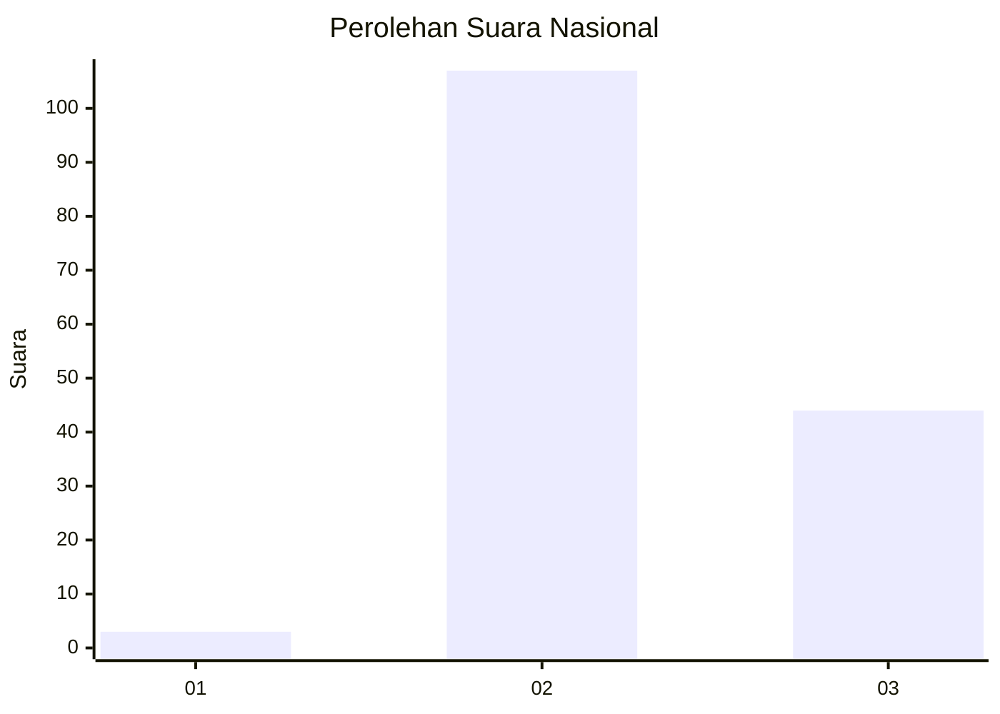
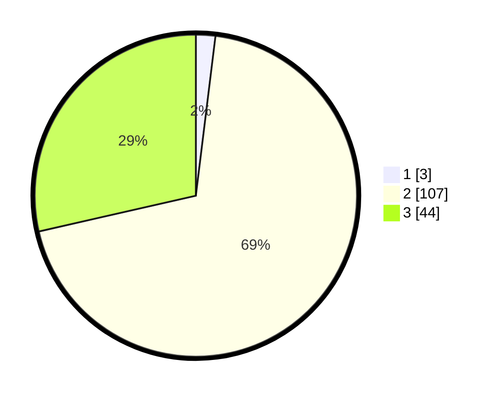

# Hasil

## Grafik

## Tabel

| No. | Nama Paslon    | Suara | Suara (raw) | Persentase |
|:--- |:-------------- | -----:| -----------:| ----------:|
| 1   | ANIES MUHAIMIN | 3     | [3][p-1]    | 1,95       |
| 2   | PRABOWO GIBRAN | 107   | [107][p-2]  | 69,48      |
| 3   | GANJAR MAHFUD  | 44    | [44][p-3]   | 28,57      |

[p-1]: https://github.com/gigit-pemilu/pemilu-2024/blob/main/pilpres/hitung-suara/sub/82-maluku-utara/sub/03-halmahera-utara/sub/09-loloda-utara/sub/2006-kailupa/sub/001-tps/sub/paslon-1.txt
[p-2]: https://github.com/gigit-pemilu/pemilu-2024/blob/main/pilpres/hitung-suara/sub/82-maluku-utara/sub/03-halmahera-utara/sub/09-loloda-utara/sub/2006-kailupa/sub/001-tps/sub/paslon-2.txt
[p-3]: https://github.com/gigit-pemilu/pemilu-2024/blob/main/pilpres/hitung-suara/sub/82-maluku-utara/sub/03-halmahera-utara/sub/09-loloda-utara/sub/2006-kailupa/sub/001-tps/sub/paslon-3.txt

## Foto C Plano

https://sirekap-obj-formc.kpu.go.id/81d4/pemilu/ppwp/82/03/09/20/06/8203092006001-20240222-152526--315e79cc-5241-4d91-9cce-d55ce7982819.jpg

https://sirekap-obj-formc.kpu.go.id/81d4/pemilu/ppwp/82/03/09/20/06/8203092006001-20240222-152328--b60175c9-b252-4ccf-a5d3-90e0b395ca6c.jpg

https://sirekap-obj-formc.kpu.go.id/81d4/pemilu/ppwp/82/03/09/20/06/8203092006001-20240222-152430--8d131d4a-a589-4078-b188-7b77b99c9789.jpg

## Metadata

| Key        | Value               |
| ---------- | ------------------- |
| Time Stamp | 2024-02-22 16:00:00 |

## DATA PEMILIH TETAP

Jumlah pemilih dalam DPT: **898**.
 * L: **688**.
 * P: **884**.

## DATA PENGGUNA HAK PILIH

Jumlah pengguna hak pilih dalam DPT: **582**.
 * L: **834**.
 * P: **385**.

Jumlah pengguna hak pilih dalam DPTb: **962**.
 * L: **592**.
 * P: **296**.

Jumlah pengguna hak pilih dalam DPK: **922**.
 * L: **294**.
 * P: **886**.

Jumlah pengguna hak pilih: **494**.
 * L: **684**.
 * P: **632**.

## JUMLAH SUARA SAH DAN TIDAK SAH

JUMLAH SELURUH SUARA SAH: **154**.

JUMLAH SUARA TIDAK SAH: **0**.

JUMLAH SELURUH SUARA SAH DAN SUARA TIDAK SAH: **154**.

