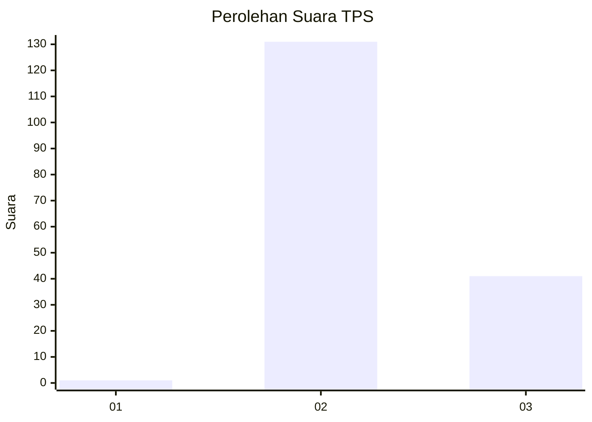
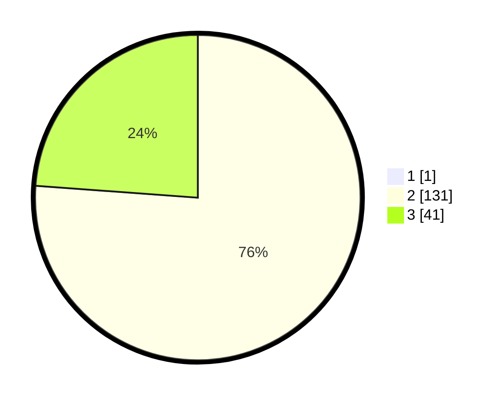

# Hasil

## Grafik

## Tabel

| No. | Nama Paslon    | Suara | Suara (raw) | Persentase |
|:--- |:-------------- | -----:| -----------:| ----------:|
| 1   | ANIES MUHAIMIN | 1     | [1][p-1]    | 0,58       |
| 2   | PRABOWO GIBRAN | 131   | [131][p-2]  | 75,72      |
| 3   | GANJAR MAHFUD  | 41    | [41][p-3]   | 23,70      |

[p-1]: https://github.com/gigit-pemilu/pemilu-2024-82-maluku-utara/blob/main/pilpres/hitung-suara/sub/82-maluku-utara/sub/03-halmahera-utara/sub/09-loloda-utara/sub/2006-kailupa/sub/002-tps/sub/paslon-1.txt
[p-2]: https://github.com/gigit-pemilu/pemilu-2024-82-maluku-utara/blob/main/pilpres/hitung-suara/sub/82-maluku-utara/sub/03-halmahera-utara/sub/09-loloda-utara/sub/2006-kailupa/sub/002-tps/sub/paslon-2.txt
[p-3]: https://github.com/gigit-pemilu/pemilu-2024-82-maluku-utara/blob/main/pilpres/hitung-suara/sub/82-maluku-utara/sub/03-halmahera-utara/sub/09-loloda-utara/sub/2006-kailupa/sub/002-tps/sub/paslon-3.txt

## Foto C Plano

https://sirekap-obj-formc.kpu.go.id/3c20/pemilu/ppwp/82/03/09/20/06/8203092006002-20240222-151529--3191c978-7abc-459f-972b-74e8342efce5.jpg

https://sirekap-obj-formc.kpu.go.id/3c20/pemilu/ppwp/82/03/09/20/06/8203092006002-20240222-151431--e940609d-f74c-4185-89fa-724cc721518c.jpg

https://sirekap-obj-formc.kpu.go.id/3c20/pemilu/ppwp/82/03/09/20/06/8203092006002-20240222-151235--f55b8298-099c-4b71-a96b-de1e771ee4f2.jpg

## Metadata

| Key        | Value               |
| ---------- | ------------------- |
| Time Stamp | 2024-02-22 16:00:00 |

## DATA PEMILIH TETAP

Jumlah pemilih dalam DPT: **235**.
 * L: **636**.
 * P: **603**.

## DATA PENGGUNA HAK PILIH

Jumlah pengguna hak pilih dalam DPT: **166**.
 * L: **673**.
 * P: **983**.

Jumlah pengguna hak pilih dalam DPTb: **4**.
 * L: **664**.
 * P: **2**.

Jumlah pengguna hak pilih dalam DPK: **2**.
 * L: **683**.
 * P: **3**.

Jumlah pengguna hak pilih: **173**.
 * L: **223**.
 * P: **274**.

## JUMLAH SUARA SAH DAN TIDAK SAH

JUMLAH SELURUH SUARA SAH: **173**.

JUMLAH SUARA TIDAK SAH: **0**.

JUMLAH SELURUH SUARA SAH DAN SUARA TIDAK SAH: **173**.

