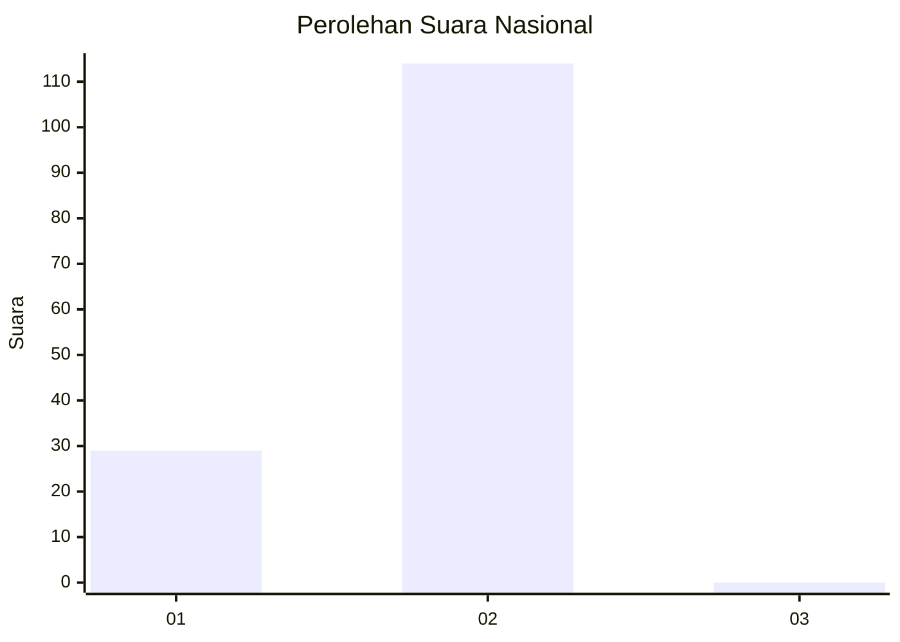
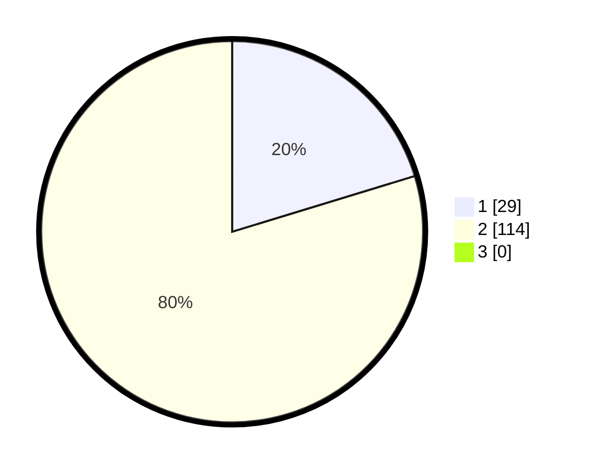

# Hasil

## Grafik

## Tabel

| No. | Nama Paslon    | Suara | Suara (raw) | Persentase |
|:--- |:-------------- | -----:| -----------:| ----------:|
| 1   | ANIES MUHAIMIN | 29    | [29][p-1]   | 20,28      |
| 2   | PRABOWO GIBRAN | 114   | [114][p-2]  | 79,72      |
| 3   | GANJAR MAHFUD  | 0     | [0][p-3]    | 0,00       |

[p-1]: https://github.com/gigit-pemilu/pemilu-2024/blob/main/pilpres/hitung-suara/sub/82-maluku-utara/sub/03-halmahera-utara/sub/09-loloda-utara/sub/2010-tate/sub/002-tps/sub/paslon-1.txt
[p-2]: https://github.com/gigit-pemilu/pemilu-2024/blob/main/pilpres/hitung-suara/sub/82-maluku-utara/sub/03-halmahera-utara/sub/09-loloda-utara/sub/2010-tate/sub/002-tps/sub/paslon-2.txt
[p-3]: https://github.com/gigit-pemilu/pemilu-2024/blob/main/pilpres/hitung-suara/sub/82-maluku-utara/sub/03-halmahera-utara/sub/09-loloda-utara/sub/2010-tate/sub/002-tps/sub/paslon-3.txt

## Foto C Plano

https://sirekap-obj-formc.kpu.go.id/ef43/pemilu/ppwp/82/03/09/20/10/8203092010002-20240222-160100--5dbf8b9c-34f8-4448-8aed-c542aae4038c.jpg

https://sirekap-obj-formc.kpu.go.id/ef43/pemilu/ppwp/82/03/09/20/10/8203092010002-20240222-160147--4f19eaf4-9488-40f7-8c2f-5f0382ac3b55.jpg

https://sirekap-obj-formc.kpu.go.id/ef43/pemilu/ppwp/82/03/09/20/10/8203092010002-20240222-160234--f63a4e3c-203f-4588-9c95-044afa4e5e8f.jpg

## Metadata

| Key        | Value               |
| ---------- | ------------------- |
| Time Stamp | 2024-02-22 17:00:00 |

## DATA PEMILIH TETAP

Jumlah pemilih dalam DPT: **674**.
 * L: **895**.
 * P: **87**.

## DATA PENGGUNA HAK PILIH

Jumlah pengguna hak pilih dalam DPT: **670**.
 * L: **63**.
 * P: **73**.

Jumlah pengguna hak pilih dalam DPTb: **4**.
 * L: **884**.
 * P: **7**.

Jumlah pengguna hak pilih dalam DPK: **5**.
 * L: **0**.
 * P: **82**.

Jumlah pengguna hak pilih: **148**.
 * L: **69**.
 * P: **46**.

## JUMLAH SUARA SAH DAN TIDAK SAH

JUMLAH SELURUH SUARA SAH: **143**.

JUMLAH SUARA TIDAK SAH: **2**.

JUMLAH SELURUH SUARA SAH DAN SUARA TIDAK SAH: **145**.

