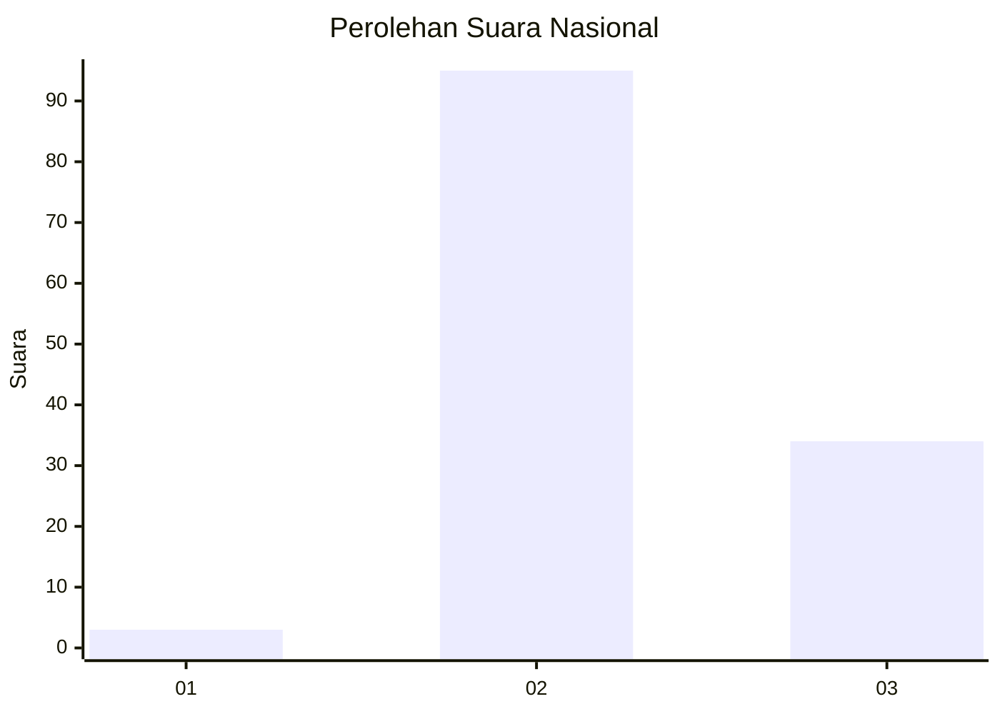
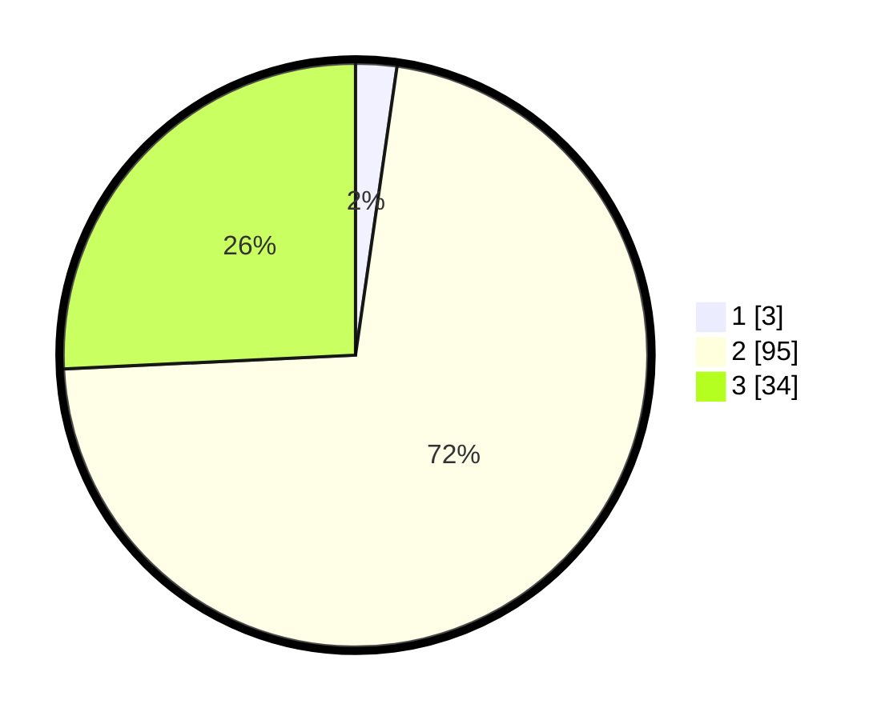

# Hasil

## Grafik

## Tabel

| No. | Nama Paslon    | Suara | Suara (raw) | Persentase |
|:--- |:-------------- | -----:| -----------:| ----------:|
| 1   | ANIES MUHAIMIN | 3     | [3][p-1]    | 2,27       |
| 2   | PRABOWO GIBRAN | 95    | [95][p-2]   | 71,97      |
| 3   | GANJAR MAHFUD  | 34    | [34][p-3]   | 25,76      |

[p-1]: https://github.com/gigit-pemilu/pemilu-2024/blob/main/pilpres/hitung-suara/sub/82-maluku-utara/sub/03-halmahera-utara/sub/09-loloda-utara/sub/2028-momojiu/sub/001-tps/sub/paslon-1.txt
[p-2]: https://github.com/gigit-pemilu/pemilu-2024/blob/main/pilpres/hitung-suara/sub/82-maluku-utara/sub/03-halmahera-utara/sub/09-loloda-utara/sub/2028-momojiu/sub/001-tps/sub/paslon-2.txt
[p-3]: https://github.com/gigit-pemilu/pemilu-2024/blob/main/pilpres/hitung-suara/sub/82-maluku-utara/sub/03-halmahera-utara/sub/09-loloda-utara/sub/2028-momojiu/sub/001-tps/sub/paslon-3.txt

## Foto C Plano

https://sirekap-obj-formc.kpu.go.id/a1ef/pemilu/ppwp/82/03/09/20/28/8203092028001-20240222-161755--11fd626c-c69f-44d2-8cf1-f29d61ee33a6.jpg

https://sirekap-obj-formc.kpu.go.id/a1ef/pemilu/ppwp/82/03/09/20/28/8203092028001-20240222-161913--d077ed85-d10a-4fd2-a09e-9b67e12a25d2.jpg

https://sirekap-obj-formc.kpu.go.id/a1ef/pemilu/ppwp/82/03/09/20/28/8203092028001-20240222-162003--d2bab438-687f-42ec-9fbf-0d32e32f2608.jpg

## Metadata

| Key        | Value               |
| ---------- | ------------------- |
| Time Stamp | 2024-02-22 17:00:00 |

## DATA PEMILIH TETAP

Jumlah pemilih dalam DPT: **493**.
 * L: **409**.
 * P: **808**.

## DATA PENGGUNA HAK PILIH

Jumlah pengguna hak pilih dalam DPT: **438**.
 * L: **832**.
 * P: **56**.

Jumlah pengguna hak pilih dalam DPTb: **405**.
 * L: **883**.
 * P: **800**.

Jumlah pengguna hak pilih dalam DPK: **802**.
 * L: **844**.
 * P: **805**.

Jumlah pengguna hak pilih: **434**.
 * L: **47**.
 * P: **57**.

## JUMLAH SUARA SAH DAN TIDAK SAH

JUMLAH SELURUH SUARA SAH: **132**.

JUMLAH SUARA TIDAK SAH: **2**.

JUMLAH SELURUH SUARA SAH DAN SUARA TIDAK SAH: **134**.

