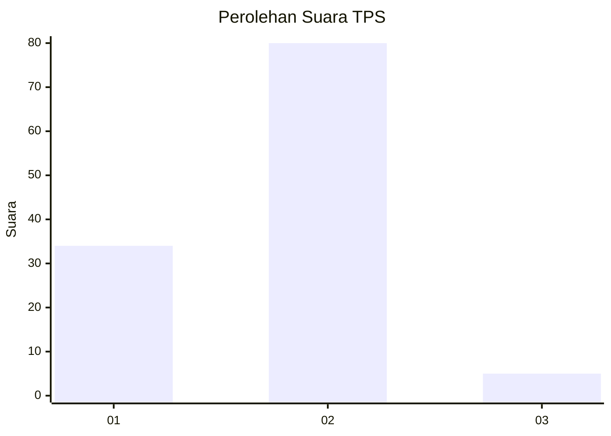
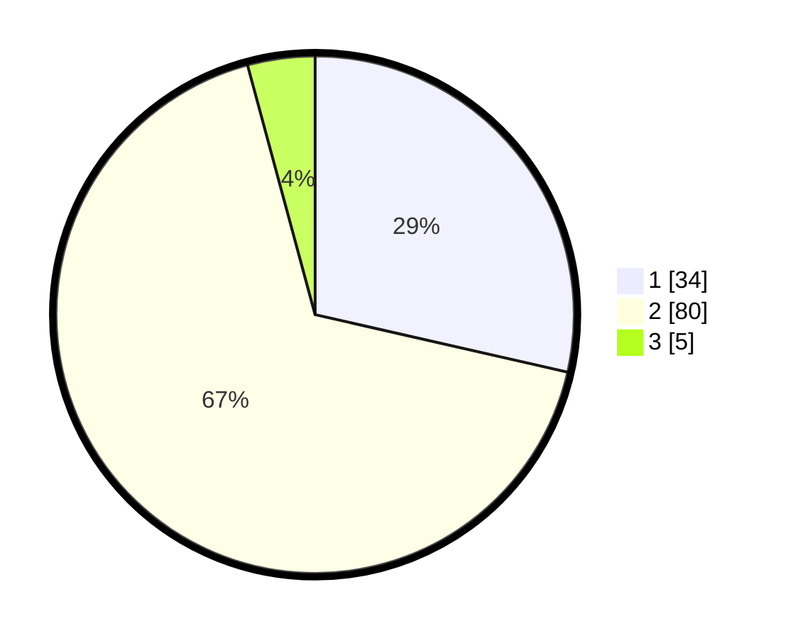

# Hasil

## Grafik

## Tabel

| No. | Nama Paslon    | Suara | Suara (raw) | Persentase |
|:--- |:-------------- | -----:| -----------:| ----------:|
| 1   | ANIES MUHAIMIN | 34    | [34][p-1]   | 28,57      |
| 2   | PRABOWO GIBRAN | 80    | [80][p-2]   | 67,23      |
| 3   | GANJAR MAHFUD  | 5     | [5][p-3]    | 4,20       |

[p-1]: https://github.com/gigit-pemilu/pemilu-2024-82-maluku-utara/blob/main/pilpres/hitung-suara/sub/82-maluku-utara/sub/05-kepulauan-sula/sub/02-sanana/sub/2001-mangon/sub/012-tps/sub/paslon-1.txt
[p-2]: https://github.com/gigit-pemilu/pemilu-2024-82-maluku-utara/blob/main/pilpres/hitung-suara/sub/82-maluku-utara/sub/05-kepulauan-sula/sub/02-sanana/sub/2001-mangon/sub/012-tps/sub/paslon-2.txt
[p-3]: https://github.com/gigit-pemilu/pemilu-2024-82-maluku-utara/blob/main/pilpres/hitung-suara/sub/82-maluku-utara/sub/05-kepulauan-sula/sub/02-sanana/sub/2001-mangon/sub/012-tps/sub/paslon-3.txt

## Foto C Plano

https://sirekap-obj-formc.kpu.go.id/a684/pemilu/ppwp/82/05/02/20/01/8205022001012-20240215-163657--a135f51e-fa5d-4c04-97b1-280e52fb529f.jpg

https://sirekap-obj-formc.kpu.go.id/a684/pemilu/ppwp/82/05/02/20/01/8205022001012-20240215-163841--788bee68-75a9-46b1-9a7a-c999f78d7f0d.jpg

https://sirekap-obj-formc.kpu.go.id/a684/pemilu/ppwp/82/05/02/20/01/8205022001012-20240215-164125--e40e009a-fbbb-4fe6-a99d-813482847dc0.jpg

## Metadata

| Key        | Value               |
| ---------- | ------------------- |
| Time Stamp | 2024-02-15 18:00:26 |

