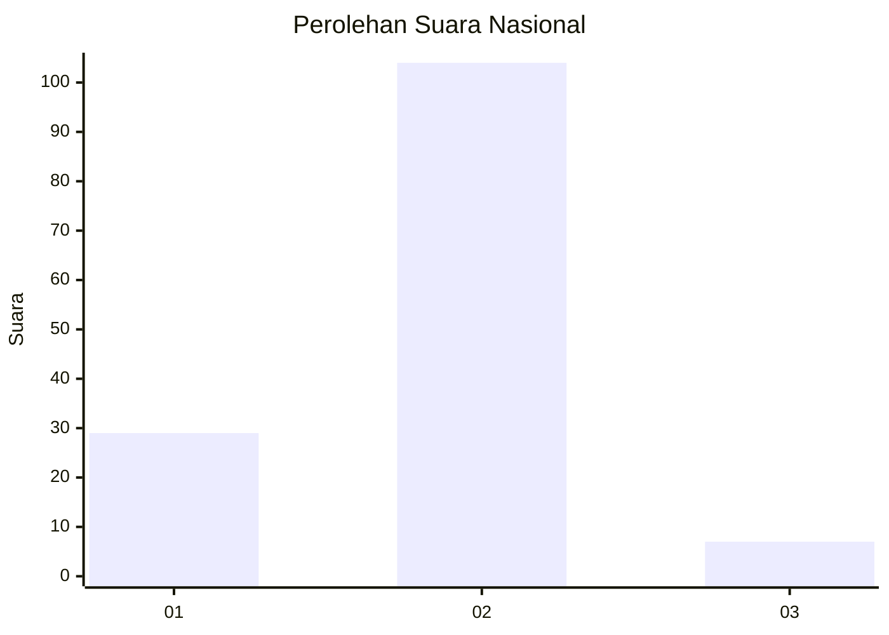
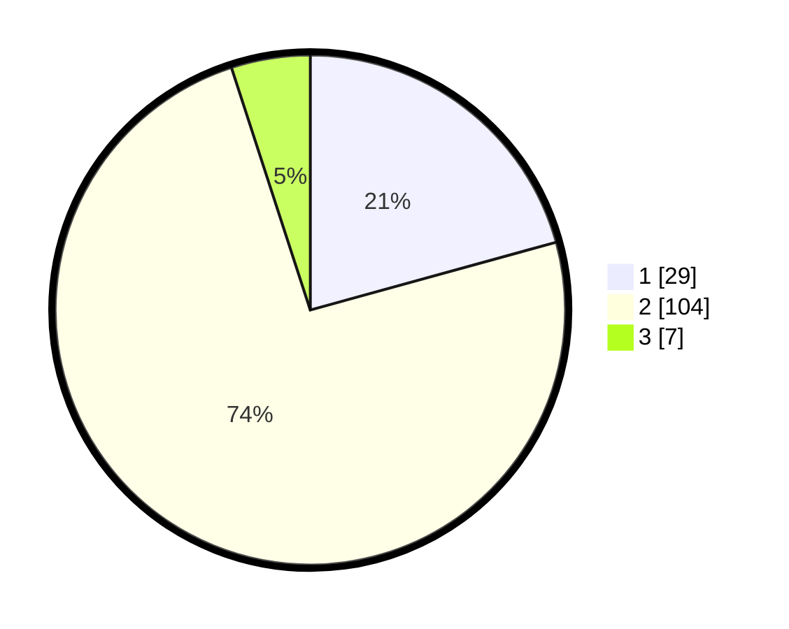

# Hasil

## Grafik

## Tabel

| No. | Nama Paslon    | Suara | Suara (raw) | Persentase |
|:--- |:-------------- | -----:| -----------:| ----------:|
| 1   | ANIES MUHAIMIN | 29    | [29][p-1]   | 20,71      |
| 2   | PRABOWO GIBRAN | 104   | [104][p-2]  | 74,29      |
| 3   | GANJAR MAHFUD  | 7     | [7][p-3]    | 5,00       |

[p-1]: https://github.com/gigit-pemilu/pemilu-2024/blob/main/pilpres/hitung-suara/sub/82-maluku-utara/sub/05-kepulauan-sula/sub/02-sanana/sub/2001-mangon/sub/013-tps/sub/paslon-1.txt
[p-2]: https://github.com/gigit-pemilu/pemilu-2024/blob/main/pilpres/hitung-suara/sub/82-maluku-utara/sub/05-kepulauan-sula/sub/02-sanana/sub/2001-mangon/sub/013-tps/sub/paslon-2.txt
[p-3]: https://github.com/gigit-pemilu/pemilu-2024/blob/main/pilpres/hitung-suara/sub/82-maluku-utara/sub/05-kepulauan-sula/sub/02-sanana/sub/2001-mangon/sub/013-tps/sub/paslon-3.txt

## Foto C Plano

https://sirekap-obj-formc.kpu.go.id/2019/pemilu/ppwp/82/05/02/20/01/8205022001013-20240215-164804--8604912a-1c4b-4a28-8451-a94578949ad3.jpg

https://sirekap-obj-formc.kpu.go.id/2019/pemilu/ppwp/82/05/02/20/01/8205022001013-20240215-165018--2844e2bc-7db6-49bc-8aab-d4b01db690a4.jpg

https://sirekap-obj-formc.kpu.go.id/2019/pemilu/ppwp/82/05/02/20/01/8205022001013-20240215-165240--1761041c-43e7-434e-ae38-1cff2fca1be7.jpg

## Metadata

| Key        | Value               |
| ---------- | ------------------- |
| Time Stamp | 2024-02-15 17:30:25 |

