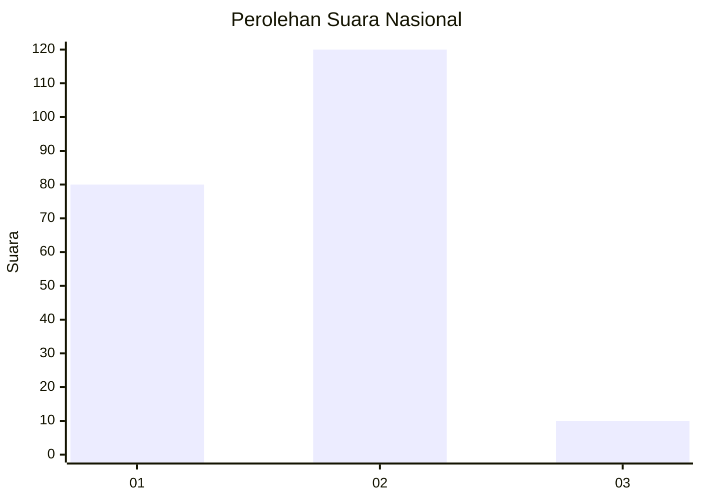
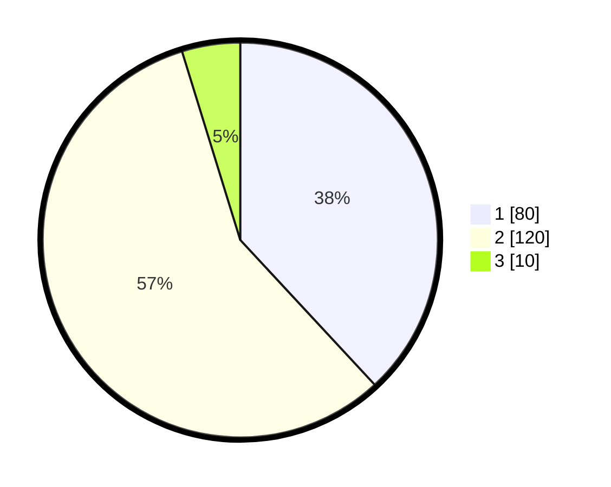

# Hasil

## Grafik

## Tabel

| No. | Nama Paslon    | Suara | Suara (raw) | Persentase |
|:--- |:-------------- | -----:| -----------:| ----------:|
| 1   | ANIES MUHAIMIN | 80    | [80][p-1]   | 38,10      |
| 2   | PRABOWO GIBRAN | 120   | [120][p-2]  | 57,14      |
| 3   | GANJAR MAHFUD  | 10    | [10][p-3]   | 4,76       |

[p-1]: https://github.com/gigit-pemilu/pemilu-2024/blob/main/pilpres/hitung-suara/sub/82-maluku-utara/sub/05-kepulauan-sula/sub/02-sanana/sub/2002-fagudu/sub/002-tps/sub/paslon-1.txt
[p-2]: https://github.com/gigit-pemilu/pemilu-2024/blob/main/pilpres/hitung-suara/sub/82-maluku-utara/sub/05-kepulauan-sula/sub/02-sanana/sub/2002-fagudu/sub/002-tps/sub/paslon-2.txt
[p-3]: https://github.com/gigit-pemilu/pemilu-2024/blob/main/pilpres/hitung-suara/sub/82-maluku-utara/sub/05-kepulauan-sula/sub/02-sanana/sub/2002-fagudu/sub/002-tps/sub/paslon-3.txt

## Foto C Plano

https://sirekap-obj-formc.kpu.go.id/64d5/pemilu/ppwp/82/05/02/20/02/8205022002002-20240215-165515--6abb350b-2f4c-41e7-92ea-115afc478241.jpg

https://sirekap-obj-formc.kpu.go.id/64d5/pemilu/ppwp/82/05/02/20/02/8205022002002-20240215-165935--3ca25bb5-26ca-4e0e-96fd-029292251a65.jpg

https://sirekap-obj-formc.kpu.go.id/64d5/pemilu/ppwp/82/05/02/20/02/8205022002002-20240215-170123--bf1dc742-e1f6-4204-aad2-b52a34ac6c97.jpg

## Metadata

| Key        | Value               |
| ---------- | ------------------- |
| Time Stamp | 2024-02-15 17:30:25 |

