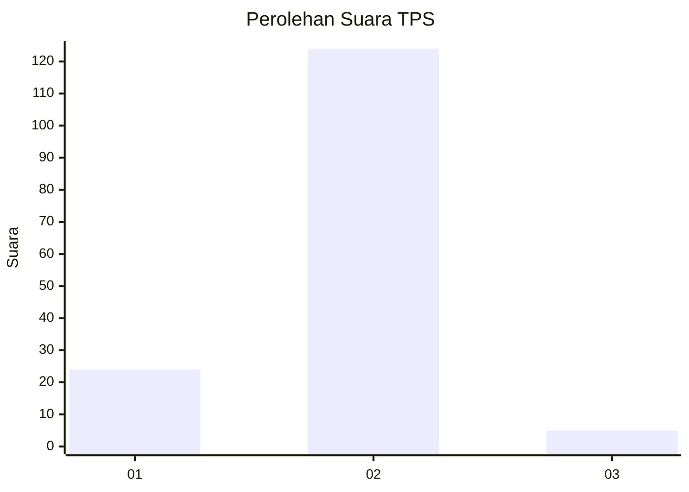
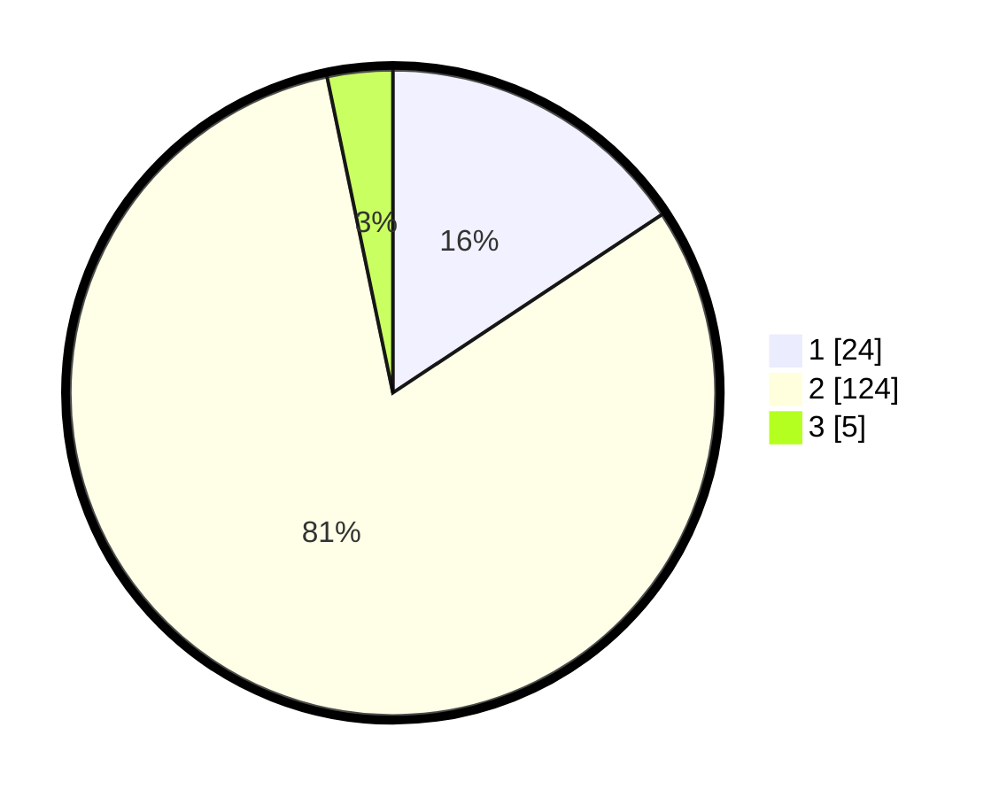

# Hasil

## Grafik

## Tabel

| No. | Nama Paslon    | Suara | Suara (raw) | Persentase |
|:--- |:-------------- | -----:| -----------:| ----------:|
| 1   | ANIES MUHAIMIN | 24    | [24][p-1]   | 15,69      |
| 2   | PRABOWO GIBRAN | 124   | [124][p-2]  | 81,05      |
| 3   | GANJAR MAHFUD  | 5     | [5][p-3]    | 3,27       |

[p-1]: https://github.com/gigit-pemilu/pemilu-2024-82-maluku-utara/blob/main/pilpres/hitung-suara/sub/82-maluku-utara/sub/05-kepulauan-sula/sub/03-sulabesi-barat/sub/2009-nahi/sub/003-tps/sub/paslon-1.txt
[p-2]: https://github.com/gigit-pemilu/pemilu-2024-82-maluku-utara/blob/main/pilpres/hitung-suara/sub/82-maluku-utara/sub/05-kepulauan-sula/sub/03-sulabesi-barat/sub/2009-nahi/sub/003-tps/sub/paslon-2.txt
[p-3]: https://github.com/gigit-pemilu/pemilu-2024-82-maluku-utara/blob/main/pilpres/hitung-suara/sub/82-maluku-utara/sub/05-kepulauan-sula/sub/03-sulabesi-barat/sub/2009-nahi/sub/003-tps/sub/paslon-3.txt

## Foto C Plano

https://sirekap-obj-formc.kpu.go.id/eb4c/pemilu/ppwp/82/05/03/20/09/8205032009003-20240216-174844--52a0acf2-2054-486a-a141-030a1a2488dc.jpg

https://sirekap-obj-formc.kpu.go.id/eb4c/pemilu/ppwp/82/05/03/20/09/8205032009003-20240216-174845--8f688c5d-6158-4fe8-aa03-dc1e78a286e1.jpg

https://sirekap-obj-formc.kpu.go.id/eb4c/pemilu/ppwp/82/05/03/20/09/8205032009003-20240216-174844--2ffab1d9-bcbd-45af-9572-ef6a15674a04.jpg

## Metadata

| Key        | Value               |
| ---------- | ------------------- |
| Time Stamp | 2024-02-17 11:30:03 |

## DATA PEMILIH TETAP

Jumlah pemilih dalam DPT: **259**.
 * L: **130**.
 * P: **124**.

## DATA PENGGUNA HAK PILIH

Jumlah pengguna hak pilih dalam DPT: **259**.
 * L: **130**.
 * P: **124**.

Jumlah pengguna hak pilih dalam DPTb: **259**.
 * L: **130**.
 * P: **124**.

Jumlah pengguna hak pilih dalam DPK: **259**.
 * L: **130**.
 * P: **124**.

Jumlah pengguna hak pilih: **259**.
 * L: **130**.
 * P: **124**.

## JUMLAH SUARA SAH DAN TIDAK SAH

JUMLAH SELURUH SUARA SAH: **153**.

JUMLAH SUARA TIDAK SAH: **9**.

JUMLAH SELURUH SUARA SAH DAN SUARA TIDAK SAH: **162**.

