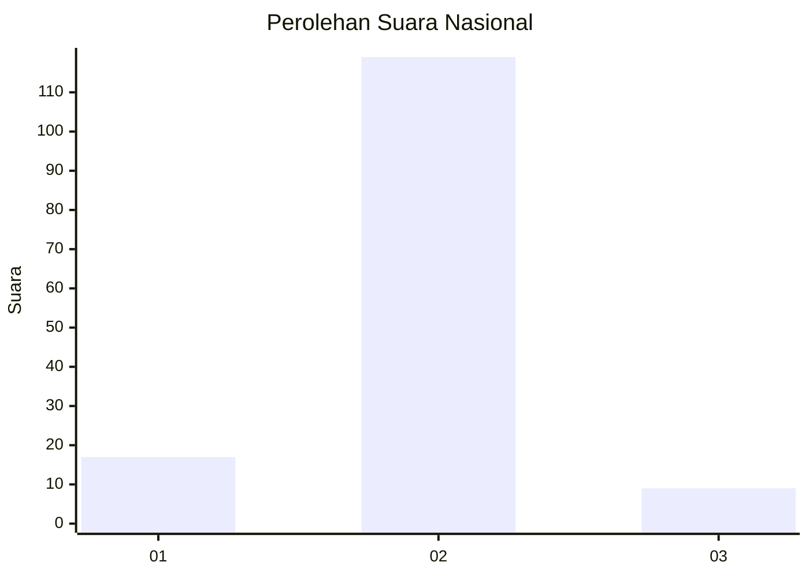
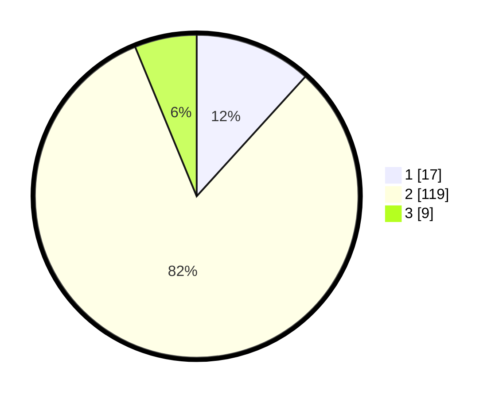

# Hasil

## Grafik

## Tabel

| No. | Nama Paslon    | Suara | Suara (raw) | Persentase |
|:--- |:-------------- | -----:| -----------:| ----------:|
| 1   | ANIES MUHAIMIN | 17    | [17][p-1]   | 11,72      |
| 2   | PRABOWO GIBRAN | 119   | [119][p-2]  | 82,07      |
| 3   | GANJAR MAHFUD  | 9     | [9][p-3]    | 6,21       |

[p-1]: https://github.com/gigit-pemilu/pemilu-2024/blob/main/pilpres/hitung-suara/sub/82-maluku-utara/sub/05-kepulauan-sula/sub/06-mangoli-barat/sub/2003-lekosula/sub/002-tps/sub/paslon-1.txt
[p-2]: https://github.com/gigit-pemilu/pemilu-2024/blob/main/pilpres/hitung-suara/sub/82-maluku-utara/sub/05-kepulauan-sula/sub/06-mangoli-barat/sub/2003-lekosula/sub/002-tps/sub/paslon-2.txt
[p-3]: https://github.com/gigit-pemilu/pemilu-2024/blob/main/pilpres/hitung-suara/sub/82-maluku-utara/sub/05-kepulauan-sula/sub/06-mangoli-barat/sub/2003-lekosula/sub/002-tps/sub/paslon-3.txt

## Foto C Plano

https://sirekap-obj-formc.kpu.go.id/ca51/pemilu/ppwp/82/05/06/20/03/8205062003002-20240215-155712--53fbe1e0-47f7-4563-bda9-82980dbb4275.jpg

https://sirekap-obj-formc.kpu.go.id/ca51/pemilu/ppwp/82/05/06/20/03/8205062003002-20240215-160016--1437f050-b6b4-4233-893a-27274fccceb3.jpg

https://sirekap-obj-formc.kpu.go.id/ca51/pemilu/ppwp/82/05/06/20/03/8205062003002-20240215-160235--e98e87c9-8b6a-45dc-838d-68fa48bc2bff.jpg

## Metadata

| Key        | Value               |
| ---------- | ------------------- |
| Time Stamp | 2024-02-15 17:30:25 |

