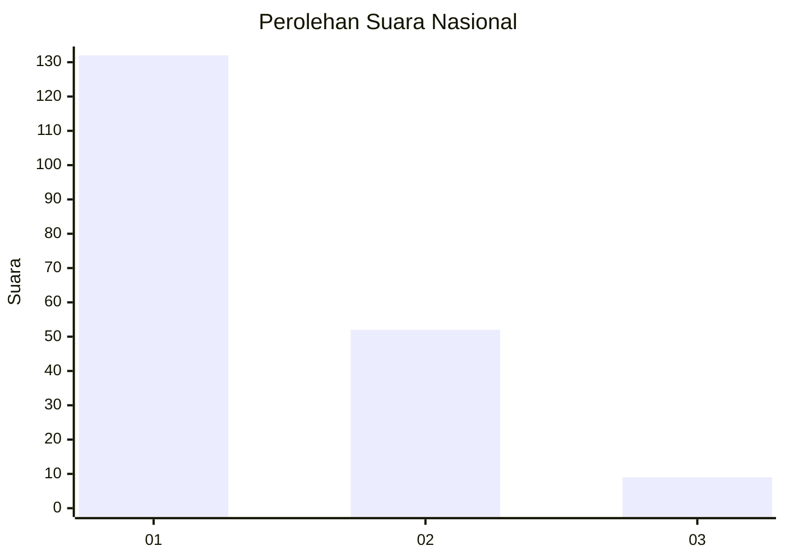
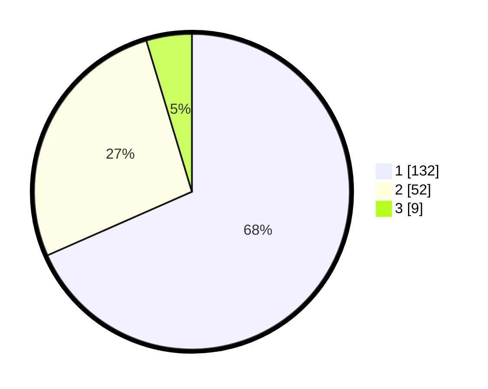

# Hasil

## Grafik

## Tabel

| No. | Nama Paslon    | Suara | Suara (raw) | Persentase |
|:--- |:-------------- | -----:| -----------:| ----------:|
| 1   | ANIES MUHAIMIN | 132   | [132][p-1]  | 68,39      |
| 2   | PRABOWO GIBRAN | 52    | [52][p-2]   | 26,94      |
| 3   | GANJAR MAHFUD  | 9     | [9][p-3]    | 4,66       |

[p-1]: https://github.com/gigit-pemilu/pemilu-2024/blob/main/pilpres/hitung-suara/sub/82-maluku-utara/sub/05-kepulauan-sula/sub/10-mangoli-utara-timur/sub/2001-kawata/sub/002-tps/sub/paslon-1.txt
[p-2]: https://github.com/gigit-pemilu/pemilu-2024/blob/main/pilpres/hitung-suara/sub/82-maluku-utara/sub/05-kepulauan-sula/sub/10-mangoli-utara-timur/sub/2001-kawata/sub/002-tps/sub/paslon-2.txt
[p-3]: https://github.com/gigit-pemilu/pemilu-2024/blob/main/pilpres/hitung-suara/sub/82-maluku-utara/sub/05-kepulauan-sula/sub/10-mangoli-utara-timur/sub/2001-kawata/sub/002-tps/sub/paslon-3.txt

## Foto C Plano

https://sirekap-obj-formc.kpu.go.id/17a0/pemilu/ppwp/82/05/10/20/01/8205102001002-20240216-124750--9cf5210f-edd4-4dc6-8df6-17deed30a466.jpg

https://sirekap-obj-formc.kpu.go.id/17a0/pemilu/ppwp/82/05/10/20/01/8205102001002-20240216-125255--ff1bf829-0096-40d1-95d8-efa8a42dac97.jpg

## Metadata

| Key        | Value               |
| ---------- | ------------------- |
| Time Stamp | 2024-02-16 13:30:32 |

