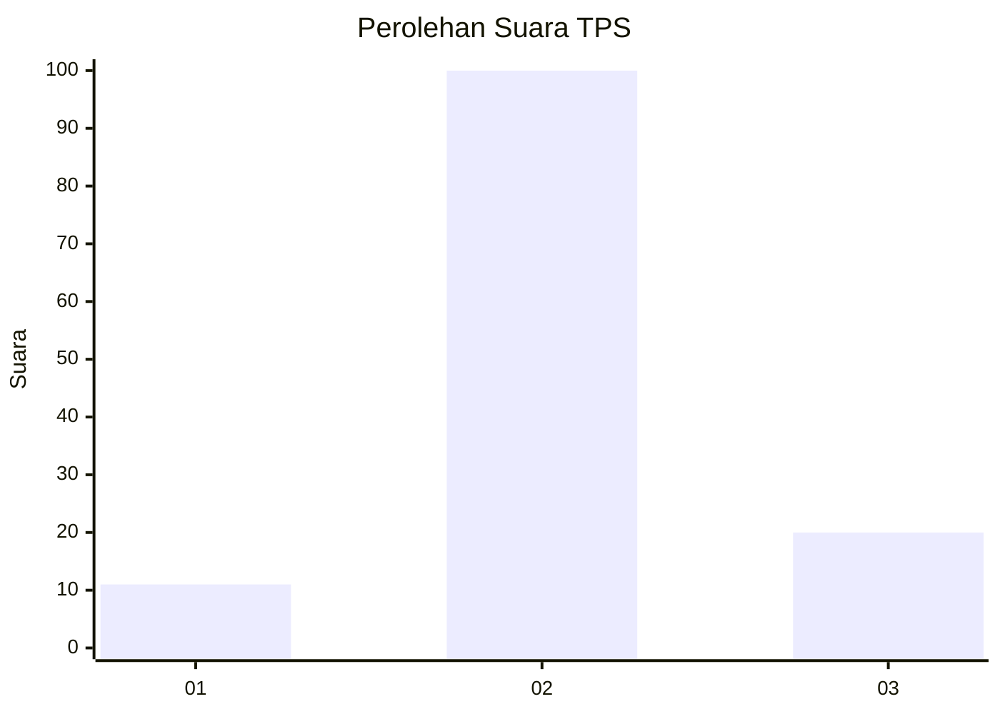

# Hasil

## Grafik

## Tabel

| No. | Nama Paslon    | Suara | Suara (raw) | Persentase |
|:--- |:-------------- | -----:| -----------:| ----------:|
| 1   | ANIES MUHAIMIN | 11    | [11][p-1]   | 8,40       |
| 2   | PRABOWO GIBRAN | 100   | [100][p-2]  | 76,34      |
| 3   | GANJAR MAHFUD  | 20    | [20][p-3]   | 15,27      |

[p-1]: https://github.com/gigit-pemilu/pemilu-2024-82-maluku-utara/blob/main/pilpres/hitung-suara/sub/82-maluku-utara/sub/05-kepulauan-sula/sub/13-mangoli-utara/sub/2005-saniahaya/sub/001-tps/sub/paslon-1.txt
[p-2]: https://github.com/gigit-pemilu/pemilu-2024-82-maluku-utara/blob/main/pilpres/hitung-suara/sub/82-maluku-utara/sub/05-kepulauan-sula/sub/13-mangoli-utara/sub/2005-saniahaya/sub/001-tps/sub/paslon-2.txt
[p-3]: https://github.com/gigit-pemilu/pemilu-2024-82-maluku-utara/blob/main/pilpres/hitung-suara/sub/82-maluku-utara/sub/05-kepulauan-sula/sub/13-mangoli-utara/sub/2005-saniahaya/sub/001-tps/sub/paslon-3.txt

## Foto C Plano

https://sirekap-obj-formc.kpu.go.id/d950/pemilu/ppwp/82/05/13/20/05/8205132005001-20240215-105334--26c7f334-a4a0-4e0d-9095-6d6315b924f0.jpg

https://sirekap-obj-formc.kpu.go.id/d950/pemilu/ppwp/82/05/13/20/05/8205132005001-20240215-110356--54da83ee-0dd0-4d9a-a096-2f648e3e0f79.jpg

https://sirekap-obj-formc.kpu.go.id/d950/pemilu/ppwp/82/05/13/20/05/8205132005001-20240215-092522--d4dc28da-0d87-42d9-8100-2b3f7c50c599.jpg

## Metadata

| Key        | Value               |
| ---------- | ------------------- |
| Time Stamp | 2024-02-15 19:30:26 |

