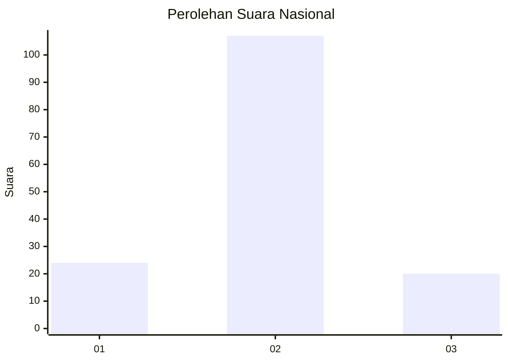
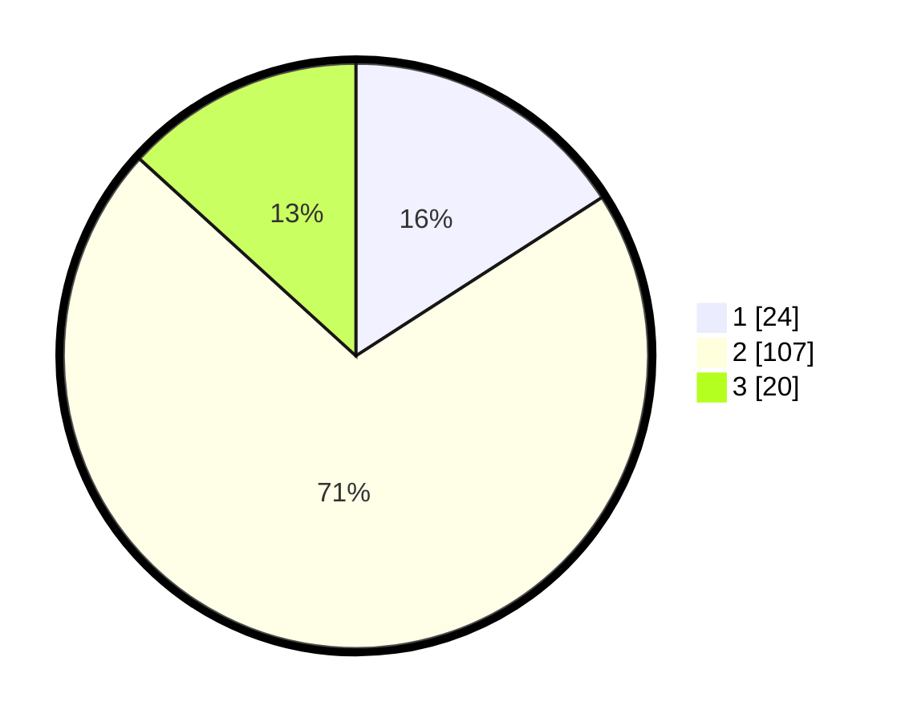

# Hasil

## Grafik

## Tabel

| No. | Nama Paslon    | Suara | Suara (raw) | Persentase |
|:--- |:-------------- | -----:| -----------:| ----------:|
| 1   | ANIES MUHAIMIN | 24    | [24][p-1]   | 15,89      |
| 2   | PRABOWO GIBRAN | 107   | [107][p-2]  | 70,86      |
| 3   | GANJAR MAHFUD  | 20    | [20][p-3]   | 13,25      |

[p-1]: https://github.com/gigit-pemilu/pemilu-2024/blob/main/pilpres/hitung-suara/sub/82-maluku-utara/sub/05-kepulauan-sula/sub/13-mangoli-utara/sub/2005-saniahaya/sub/002-tps/sub/paslon-1.txt
[p-2]: https://github.com/gigit-pemilu/pemilu-2024/blob/main/pilpres/hitung-suara/sub/82-maluku-utara/sub/05-kepulauan-sula/sub/13-mangoli-utara/sub/2005-saniahaya/sub/002-tps/sub/paslon-2.txt
[p-3]: https://github.com/gigit-pemilu/pemilu-2024/blob/main/pilpres/hitung-suara/sub/82-maluku-utara/sub/05-kepulauan-sula/sub/13-mangoli-utara/sub/2005-saniahaya/sub/002-tps/sub/paslon-3.txt

## Foto C Plano

https://sirekap-obj-formc.kpu.go.id/8da0/pemilu/ppwp/82/05/13/20/05/8205132005002-20240215-161530--e582e10f-ec2d-4e4a-8a2f-4ef36192a5e2.jpg

https://sirekap-obj-formc.kpu.go.id/8da0/pemilu/ppwp/82/05/13/20/05/8205132005002-20240215-070017--7019e8ab-73b8-466e-a13b-bae6cd16f71e.jpg

https://sirekap-obj-formc.kpu.go.id/8da0/pemilu/ppwp/82/05/13/20/05/8205132005002-20240215-070139--ac3336a9-c843-4886-87a4-3d91372a0e5a.jpg

## Metadata

| Key        | Value               |
| ---------- | ------------------- |
| Time Stamp | 2024-02-16 01:00:27 |

