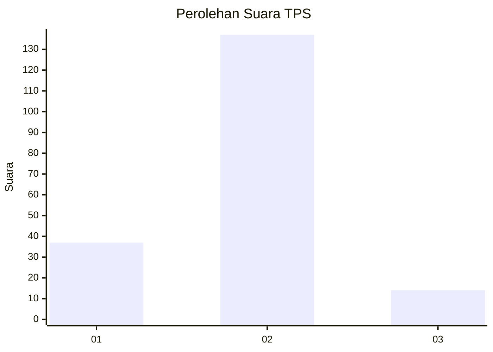
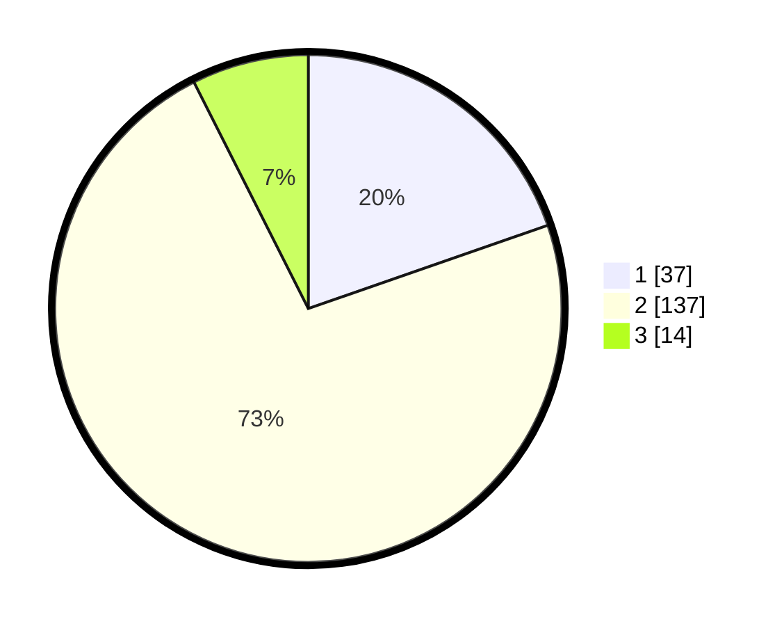

# Hasil

## Grafik

## Tabel

| No. | Nama Paslon    | Suara | Suara (raw) | Persentase |
|:--- |:-------------- | -----:| -----------:| ----------:|
| 1   | ANIES MUHAIMIN | 37    | [37][p-1]   | 19,68      |
| 2   | PRABOWO GIBRAN | 137   | [137][p-2]  | 72,87      |
| 3   | GANJAR MAHFUD  | 14    | [14][p-3]   | 7,45       |

[p-1]: https://github.com/gigit-pemilu/pemilu-2024-82-maluku-utara/blob/main/pilpres/hitung-suara/sub/82-maluku-utara/sub/05-kepulauan-sula/sub/13-mangoli-utara/sub/2007-modapuhi-trans/sub/001-tps/sub/paslon-1.txt
[p-2]: https://github.com/gigit-pemilu/pemilu-2024-82-maluku-utara/blob/main/pilpres/hitung-suara/sub/82-maluku-utara/sub/05-kepulauan-sula/sub/13-mangoli-utara/sub/2007-modapuhi-trans/sub/001-tps/sub/paslon-2.txt
[p-3]: https://github.com/gigit-pemilu/pemilu-2024-82-maluku-utara/blob/main/pilpres/hitung-suara/sub/82-maluku-utara/sub/05-kepulauan-sula/sub/13-mangoli-utara/sub/2007-modapuhi-trans/sub/001-tps/sub/paslon-3.txt

## Foto C Plano

https://sirekap-obj-formc.kpu.go.id/8f64/pemilu/ppwp/82/05/13/20/07/8205132007001-20240215-042320--77415ff8-7ee2-49a4-a3bd-cbe99a8fe404.jpg

https://sirekap-obj-formc.kpu.go.id/8f64/pemilu/ppwp/82/05/13/20/07/8205132007001-20240215-042527--42c80368-4e26-45e8-9e57-378fac08d035.jpg

https://sirekap-obj-formc.kpu.go.id/8f64/pemilu/ppwp/82/05/13/20/07/8205132007001-20240215-042633--88ecaf94-6fe0-4546-831c-ec7ad18d5d3f.jpg

## Metadata

| Key        | Value               |
| ---------- | ------------------- |
| Time Stamp | 2024-02-15 20:00:44 |

