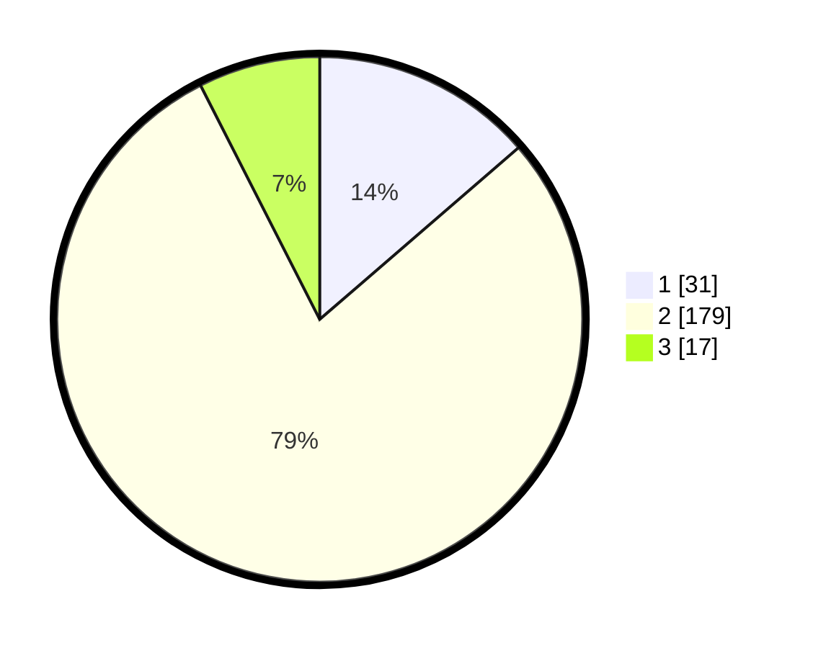

# Hasil

## Grafik

## Tabel

| No. | Nama Paslon    | Suara | Suara (raw) | Persentase |
|:--- |:-------------- | -----:| -----------:| ----------:|
| 1   | ANIES MUHAIMIN | 31    | [31][p-1]   | 13,66      |
| 2   | PRABOWO GIBRAN | 179   | [179][p-2]  | 78,85      |
| 3   | GANJAR MAHFUD  | 17    | [17][p-3]   | 7,49       |

[p-1]: https://github.com/gigit-pemilu/pemilu-2024-82-maluku-utara/blob/main/pilpres/hitung-suara/sub/82-maluku-utara/sub/06-halmahera-timur/sub/02-maba/sub/2011-wayafli/sub/002-tps/sub/paslon-1.txt
[p-2]: https://github.com/gigit-pemilu/pemilu-2024-82-maluku-utara/blob/main/pilpres/hitung-suara/sub/82-maluku-utara/sub/06-halmahera-timur/sub/02-maba/sub/2011-wayafli/sub/002-tps/sub/paslon-2.txt
[p-3]: https://github.com/gigit-pemilu/pemilu-2024-82-maluku-utara/blob/main/pilpres/hitung-suara/sub/82-maluku-utara/sub/06-halmahera-timur/sub/02-maba/sub/2011-wayafli/sub/002-tps/sub/paslon-3.txt

## Foto C Plano

https://sirekap-obj-formc.kpu.go.id/d038/pemilu/ppwp/82/06/02/20/11/8206022011002-20240215-191800--6e8df6cc-9083-49c6-af2d-0b5d8cba7011.jpg

https://sirekap-obj-formc.kpu.go.id/d038/pemilu/ppwp/82/06/02/20/11/8206022011002-20240215-192029--15ddd5d0-578b-4056-adeb-3b42f9dd4ec9.jpg

https://sirekap-obj-formc.kpu.go.id/d038/pemilu/ppwp/82/06/02/20/11/8206022011002-20240215-192213--27b91740-89a0-49a3-a656-cc8533519a61.jpg

## Metadata

| Key        | Value               |
| ---------- | ------------------- |
| Time Stamp | 2024-02-16 22:01:00 |

