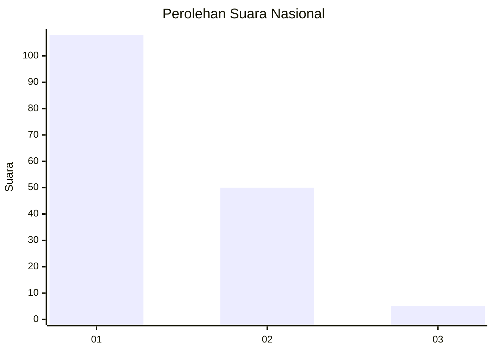
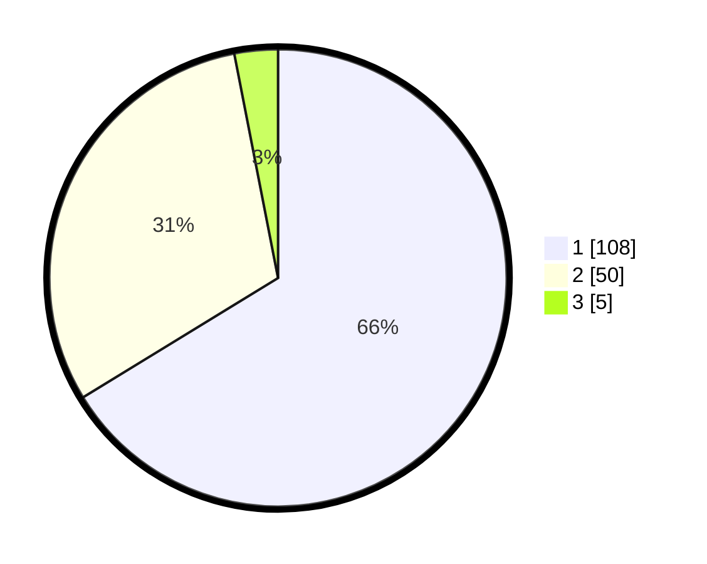

# Hasil

## Grafik

## Tabel

| No. | Nama Paslon    | Suara | Suara (raw) | Persentase |
|:--- |:-------------- | -----:| -----------:| ----------:|
| 1   | ANIES MUHAIMIN | 108   | [108][p-1]  | 66,26      |
| 2   | PRABOWO GIBRAN | 50    | [50][p-2]   | 30,67      |
| 3   | GANJAR MAHFUD  | 5     | [5][p-3]    | 3,07       |

[p-1]: https://github.com/gigit-pemilu/pemilu-2024/blob/main/pilpres/hitung-suara/sub/82-maluku-utara/sub/06-halmahera-timur/sub/03-maba-selatan/sub/2004-loleolamo/sub/001-tps/sub/paslon-1.txt
[p-2]: https://github.com/gigit-pemilu/pemilu-2024/blob/main/pilpres/hitung-suara/sub/82-maluku-utara/sub/06-halmahera-timur/sub/03-maba-selatan/sub/2004-loleolamo/sub/001-tps/sub/paslon-2.txt
[p-3]: https://github.com/gigit-pemilu/pemilu-2024/blob/main/pilpres/hitung-suara/sub/82-maluku-utara/sub/06-halmahera-timur/sub/03-maba-selatan/sub/2004-loleolamo/sub/001-tps/sub/paslon-3.txt

## Foto C Plano

https://sirekap-obj-formc.kpu.go.id/6fac/pemilu/ppwp/82/06/03/20/04/8206032004001-20240215-170835--6ebdbad2-e821-46d2-b0f9-725051de850a.jpg

https://sirekap-obj-formc.kpu.go.id/6fac/pemilu/ppwp/82/06/03/20/04/8206032004001-20240215-170858--2af35db2-7995-4d38-9bd0-52d13494c884.jpg

https://sirekap-obj-formc.kpu.go.id/6fac/pemilu/ppwp/82/06/03/20/04/8206032004001-20240215-170916--04f4becd-82a4-4022-ae4d-07581f95882c.jpg

## Metadata

| Key        | Value               |
| ---------- | ------------------- |
| Time Stamp | 2024-02-15 22:30:27 |

