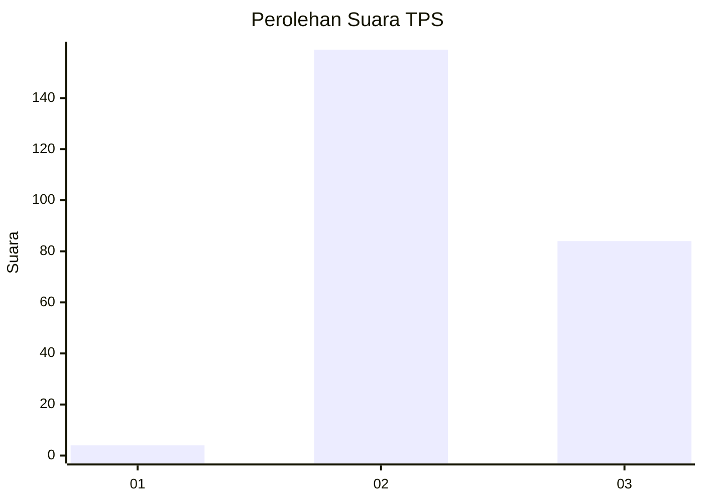
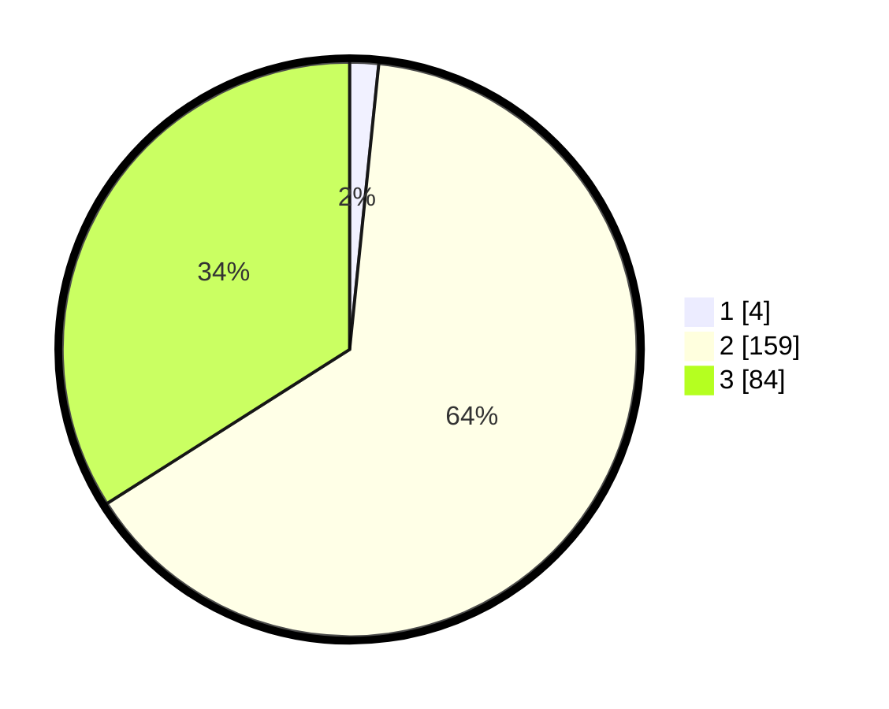

# Hasil

## Grafik

## Tabel

| No. | Nama Paslon    | Suara | Suara (raw) | Persentase |
|:--- |:-------------- | -----:| -----------:| ----------:|
| 1   | ANIES MUHAIMIN | 4     | [4][p-1]    | 1,62       |
| 2   | PRABOWO GIBRAN | 159   | [159][p-2]  | 64,37      |
| 3   | GANJAR MAHFUD  | 84    | [84][p-3]   | 34,01      |

[p-1]: https://github.com/gigit-pemilu/pemilu-2024-82-maluku-utara/blob/main/pilpres/hitung-suara/sub/82-maluku-utara/sub/06-halmahera-timur/sub/06-wasile-utara/sub/2001-labi-labi/sub/001-tps/sub/paslon-1.txt
[p-2]: https://github.com/gigit-pemilu/pemilu-2024-82-maluku-utara/blob/main/pilpres/hitung-suara/sub/82-maluku-utara/sub/06-halmahera-timur/sub/06-wasile-utara/sub/2001-labi-labi/sub/001-tps/sub/paslon-2.txt
[p-3]: https://github.com/gigit-pemilu/pemilu-2024-82-maluku-utara/blob/main/pilpres/hitung-suara/sub/82-maluku-utara/sub/06-halmahera-timur/sub/06-wasile-utara/sub/2001-labi-labi/sub/001-tps/sub/paslon-3.txt

## Foto C Plano

https://sirekap-obj-formc.kpu.go.id/f1bf/pemilu/ppwp/82/06/06/20/01/8206062001001-20240215-182501--c4f2c933-02ea-45f5-a6ab-9bfa4c606660.jpg

https://sirekap-obj-formc.kpu.go.id/f1bf/pemilu/ppwp/82/06/06/20/01/8206062001001-20240215-170706--238d35f6-20fd-4b18-ad62-5a1f4005ec3f.jpg

https://sirekap-obj-formc.kpu.go.id/f1bf/pemilu/ppwp/82/06/06/20/01/8206062001001-20240215-165115--f0251906-b44f-41e2-b47e-3720855cc012.jpg

## Metadata

| Key        | Value               |
| ---------- | ------------------- |
| Time Stamp | 2024-02-16 05:00:26 |

