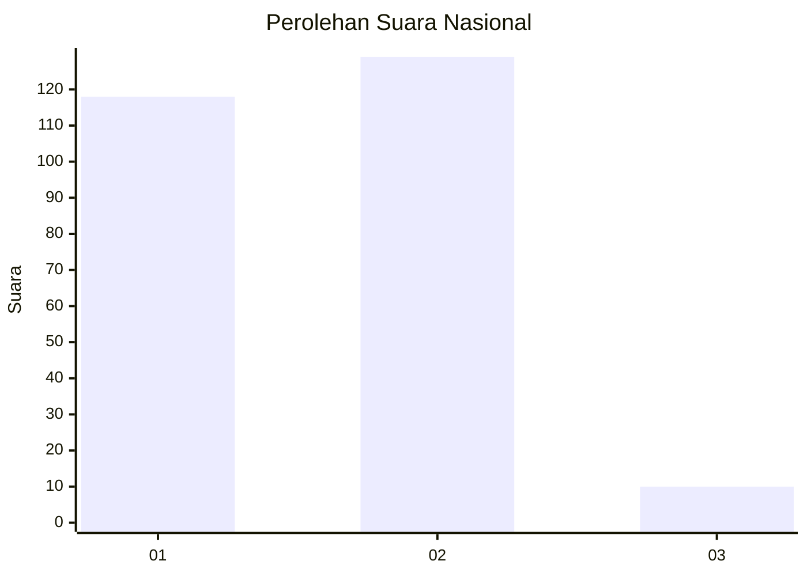
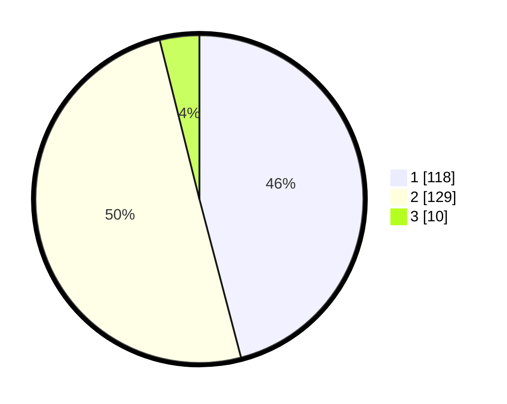

# Hasil

## Grafik

## Tabel

| No. | Nama Paslon    | Suara | Suara (raw) | Persentase |
|:--- |:-------------- | -----:| -----------:| ----------:|
| 1   | ANIES MUHAIMIN | 118   | [118][p-1]  | 45,91      |
| 2   | PRABOWO GIBRAN | 129   | [129][p-2]  | 50,19      |
| 3   | GANJAR MAHFUD  | 10    | [10][p-3]   | 3,89       |

[p-1]: https://github.com/gigit-pemilu/pemilu-2024/blob/main/pilpres/hitung-suara/sub/82-maluku-utara/sub/06-halmahera-timur/sub/10-kota-maba/sub/2004-soagimalaha/sub/001-tps/sub/paslon-1.txt
[p-2]: https://github.com/gigit-pemilu/pemilu-2024/blob/main/pilpres/hitung-suara/sub/82-maluku-utara/sub/06-halmahera-timur/sub/10-kota-maba/sub/2004-soagimalaha/sub/001-tps/sub/paslon-2.txt
[p-3]: https://github.com/gigit-pemilu/pemilu-2024/blob/main/pilpres/hitung-suara/sub/82-maluku-utara/sub/06-halmahera-timur/sub/10-kota-maba/sub/2004-soagimalaha/sub/001-tps/sub/paslon-3.txt

## Foto C Plano

https://sirekap-obj-formc.kpu.go.id/86a4/pemilu/ppwp/82/06/10/20/04/8206102004001-20240214-155121--c6f5efd3-2554-4668-90ae-5a0c93ede38f.jpg

https://sirekap-obj-formc.kpu.go.id/86a4/pemilu/ppwp/82/06/10/20/04/8206102004001-20240214-155228--cf6309f1-9d9b-421a-a1c3-e1b9dd43b407.jpg

https://sirekap-obj-formc.kpu.go.id/86a4/pemilu/ppwp/82/06/10/20/04/8206102004001-20240214-155400--231d7e5e-94f1-4666-9ee5-682a65e6c700.jpg

## Metadata

| Key        | Value               |
| ---------- | ------------------- |
| Time Stamp | 2024-02-15 12:00:28 |

