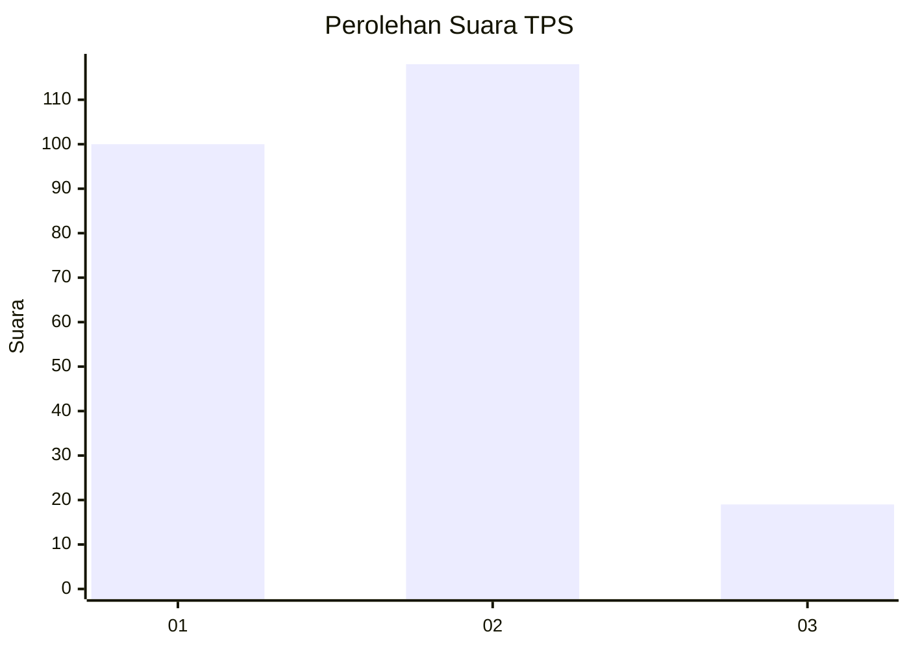
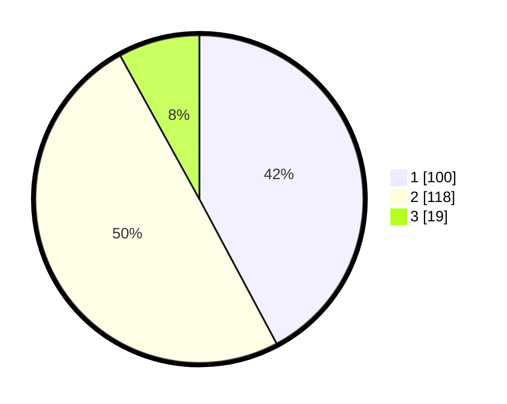

# Hasil

## Grafik

## Tabel

| No. | Nama Paslon    | Suara | Suara (raw) | Persentase |
|:--- |:-------------- | -----:| -----------:| ----------:|
| 1   | ANIES MUHAIMIN | 100   | [100][p-1]  | 42,19      |
| 2   | PRABOWO GIBRAN | 118   | [118][p-2]  | 49,79      |
| 3   | GANJAR MAHFUD  | 19    | [19][p-3]   | 8,02       |

[p-1]: https://github.com/gigit-pemilu/pemilu-2024-82-maluku-utara/blob/main/pilpres/hitung-suara/sub/82-maluku-utara/sub/06-halmahera-timur/sub/10-kota-maba/sub/2004-soagimalaha/sub/006-tps/sub/paslon-1.txt
[p-2]: https://github.com/gigit-pemilu/pemilu-2024-82-maluku-utara/blob/main/pilpres/hitung-suara/sub/82-maluku-utara/sub/06-halmahera-timur/sub/10-kota-maba/sub/2004-soagimalaha/sub/006-tps/sub/paslon-2.txt
[p-3]: https://github.com/gigit-pemilu/pemilu-2024-82-maluku-utara/blob/main/pilpres/hitung-suara/sub/82-maluku-utara/sub/06-halmahera-timur/sub/10-kota-maba/sub/2004-soagimalaha/sub/006-tps/sub/paslon-3.txt

## Foto C Plano

https://sirekap-obj-formc.kpu.go.id/112b/pemilu/ppwp/82/06/10/20/04/8206102004006-20240215-112838--a81c8f0d-1598-44ad-b341-e646c7a26723.jpg

https://sirekap-obj-formc.kpu.go.id/112b/pemilu/ppwp/82/06/10/20/04/8206102004006-20240215-113013--a8c96450-21ed-492f-b3d7-fcbdced50e23.jpg

https://sirekap-obj-formc.kpu.go.id/112b/pemilu/ppwp/82/06/10/20/04/8206102004006-20240215-113218--0aaae21a-3900-42e8-bdaa-d6d56b5756a8.jpg

## Metadata

| Key        | Value               |
| ---------- | ------------------- |
| Time Stamp | 2024-02-20 22:00:00 |

