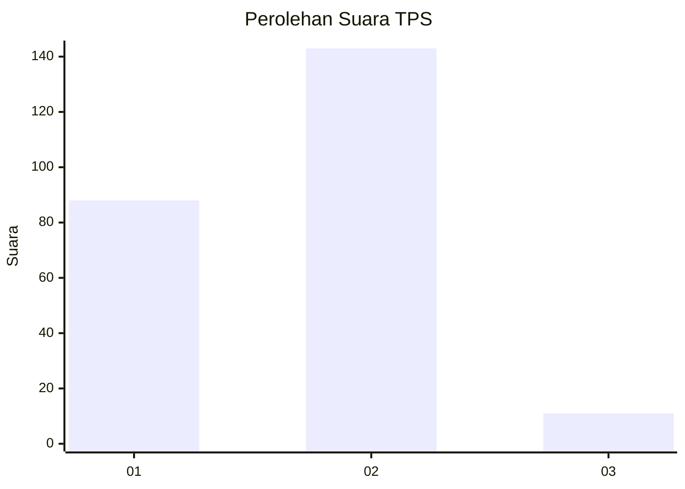
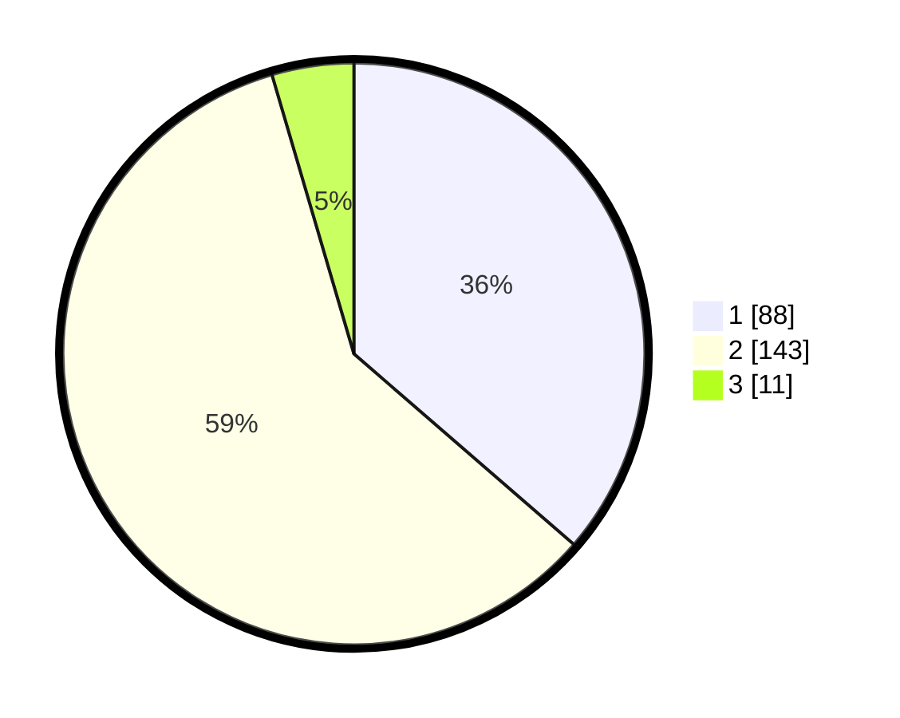

# Hasil

## Grafik

## Tabel

| No. | Nama Paslon    | Suara | Suara (raw) | Persentase |
|:--- |:-------------- | -----:| -----------:| ----------:|
| 1   | ANIES MUHAIMIN | 88    | [88][p-1]   | 36,36      |
| 2   | PRABOWO GIBRAN | 143   | [143][p-2]  | 59,09      |
| 3   | GANJAR MAHFUD  | 11    | [11][p-3]   | 4,55       |

[p-1]: https://github.com/gigit-pemilu/pemilu-2024-82-maluku-utara/blob/main/pilpres/hitung-suara/sub/82-maluku-utara/sub/06-halmahera-timur/sub/10-kota-maba/sub/2004-soagimalaha/sub/007-tps/sub/paslon-1.txt
[p-2]: https://github.com/gigit-pemilu/pemilu-2024-82-maluku-utara/blob/main/pilpres/hitung-suara/sub/82-maluku-utara/sub/06-halmahera-timur/sub/10-kota-maba/sub/2004-soagimalaha/sub/007-tps/sub/paslon-2.txt
[p-3]: https://github.com/gigit-pemilu/pemilu-2024-82-maluku-utara/blob/main/pilpres/hitung-suara/sub/82-maluku-utara/sub/06-halmahera-timur/sub/10-kota-maba/sub/2004-soagimalaha/sub/007-tps/sub/paslon-3.txt

## Foto C Plano

https://sirekap-obj-formc.kpu.go.id/445e/pemilu/ppwp/82/06/10/20/04/8206102004007-20240222-140954--d6dcf821-2049-4ddc-90d8-205de72ff35d.jpg

https://sirekap-obj-formc.kpu.go.id/445e/pemilu/ppwp/82/06/10/20/04/8206102004007-20240215-143344--9af8c1a4-9cd5-4b43-b899-535f593124d3.jpg

https://sirekap-obj-formc.kpu.go.id/445e/pemilu/ppwp/82/06/10/20/04/8206102004007-20240215-144256--d089e240-b4c8-49d2-8d38-fa56c604f154.jpg

## Metadata

| Key        | Value               |
| ---------- | ------------------- |
| Time Stamp | 2024-02-22 15:00:00 |

