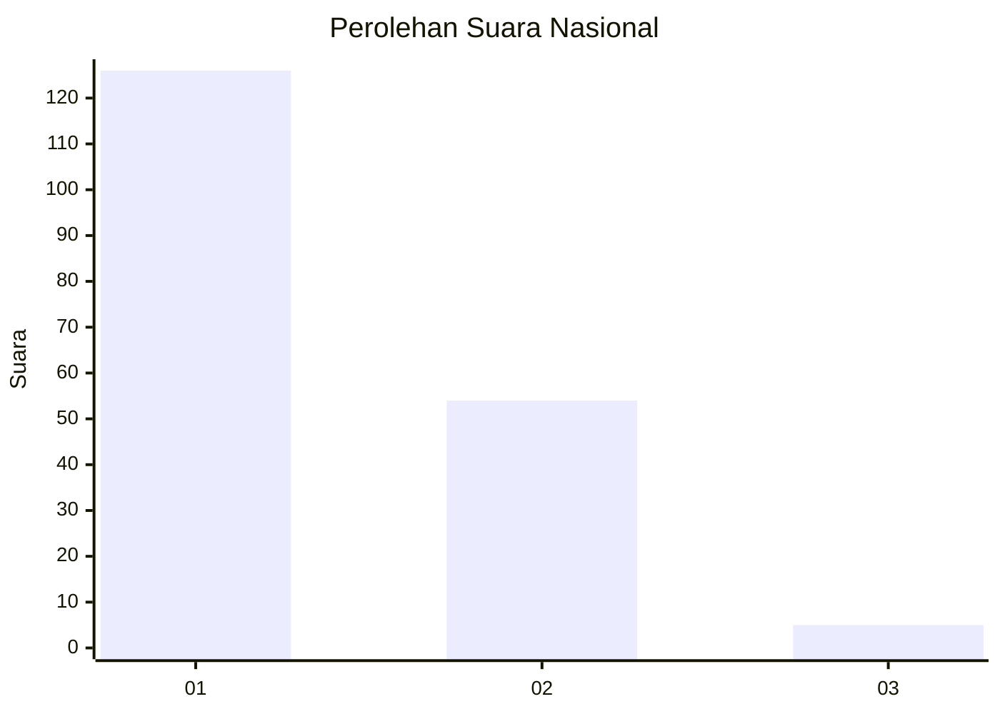
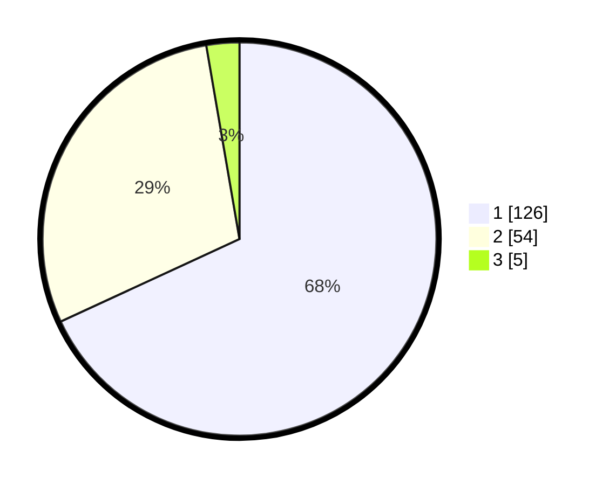

# Hasil

## Grafik

## Tabel

| No. | Nama Paslon    | Suara | Suara (raw) | Persentase |
|:--- |:-------------- | -----:| -----------:| ----------:|
| 1   | ANIES MUHAIMIN | 126   | [126][p-1]  | 68,11      |
| 2   | PRABOWO GIBRAN | 54    | [54][p-2]   | 29,19      |
| 3   | GANJAR MAHFUD  | 5     | [5][p-3]    | 2,70       |

[p-1]: https://github.com/gigit-pemilu/pemilu-2024/blob/main/pilpres/hitung-suara/sub/82-maluku-utara/sub/07-pulau-morotai/sub/01-morotai-selatan/sub/2001-gotalamo/sub/007-tps/sub/paslon-1.txt
[p-2]: https://github.com/gigit-pemilu/pemilu-2024/blob/main/pilpres/hitung-suara/sub/82-maluku-utara/sub/07-pulau-morotai/sub/01-morotai-selatan/sub/2001-gotalamo/sub/007-tps/sub/paslon-2.txt
[p-3]: https://github.com/gigit-pemilu/pemilu-2024/blob/main/pilpres/hitung-suara/sub/82-maluku-utara/sub/07-pulau-morotai/sub/01-morotai-selatan/sub/2001-gotalamo/sub/007-tps/sub/paslon-3.txt

## Foto C Plano

https://sirekap-obj-formc.kpu.go.id/cecd/pemilu/ppwp/82/07/01/20/01/8207012001007-20240215-153648--7494b810-4fab-4cea-8b11-7349ad43edb2.jpg

https://sirekap-obj-formc.kpu.go.id/cecd/pemilu/ppwp/82/07/01/20/01/8207012001007-20240215-153921--74825dff-2764-4277-9dda-881fdc019b69.jpg

https://sirekap-obj-formc.kpu.go.id/cecd/pemilu/ppwp/82/07/01/20/01/8207012001007-20240215-154149--72f2d80e-cdc2-4aa9-940f-2f5b0abab0b0.jpg

## Metadata

| Key        | Value               |
| ---------- | ------------------- |
| Time Stamp | 2024-02-16 00:00:26 |

