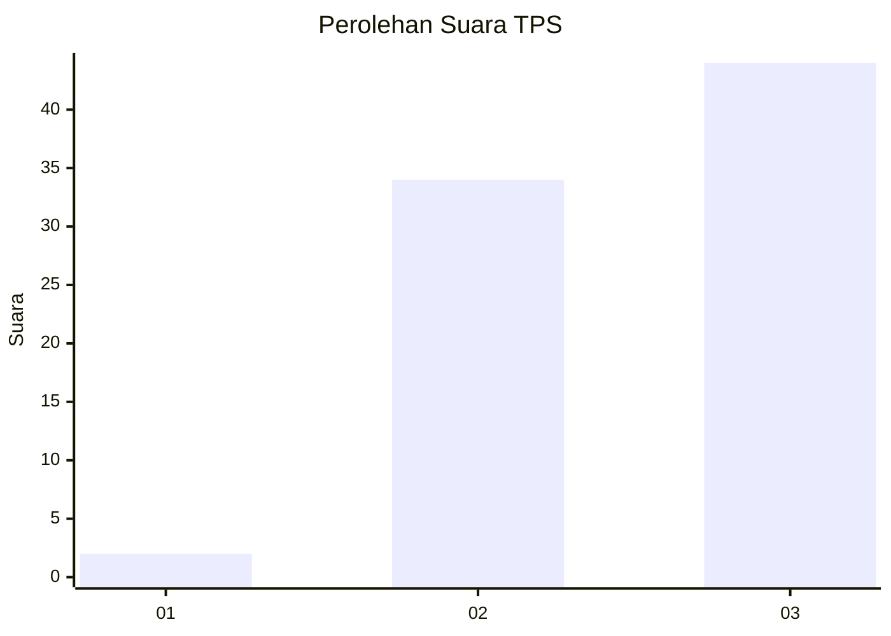
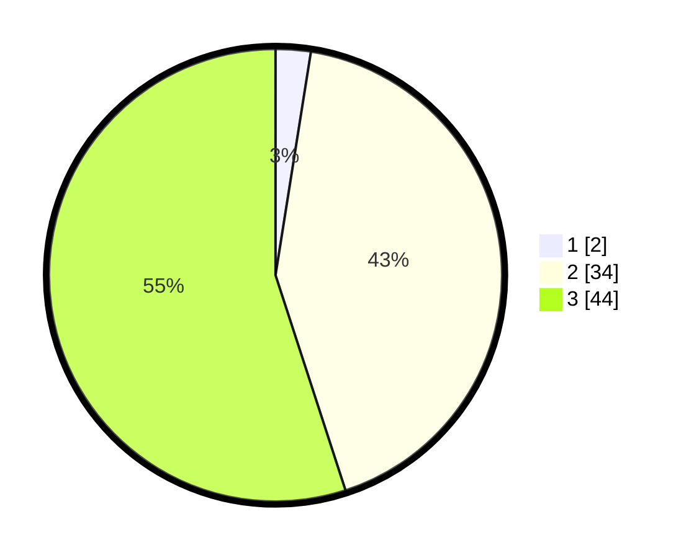

# Hasil

## Grafik

## Tabel

| No. | Nama Paslon    | Suara | Suara (raw) | Persentase |
|:--- |:-------------- | -----:| -----------:| ----------:|
| 1   | ANIES MUHAIMIN | 2     | [2][p-1]    | 2,50       |
| 2   | PRABOWO GIBRAN | 34    | [34][p-2]   | 42,50      |
| 3   | GANJAR MAHFUD  | 44    | [44][p-3]   | 55,00      |

[p-1]: https://github.com/gigit-pemilu/pemilu-2024-82-maluku-utara/blob/main/pilpres/hitung-suara/sub/82-maluku-utara/sub/08-pulau-taliabu/sub/07-taliabu-selatan/sub/2003-kilo/sub/004-tps/sub/paslon-1.txt
[p-2]: https://github.com/gigit-pemilu/pemilu-2024-82-maluku-utara/blob/main/pilpres/hitung-suara/sub/82-maluku-utara/sub/08-pulau-taliabu/sub/07-taliabu-selatan/sub/2003-kilo/sub/004-tps/sub/paslon-2.txt
[p-3]: https://github.com/gigit-pemilu/pemilu-2024-82-maluku-utara/blob/main/pilpres/hitung-suara/sub/82-maluku-utara/sub/08-pulau-taliabu/sub/07-taliabu-selatan/sub/2003-kilo/sub/004-tps/sub/paslon-3.txt

## Foto C Plano

https://sirekap-obj-formc.kpu.go.id/bfe8/pemilu/ppwp/82/08/07/20/03/8208072003004-20240217-001542--4449d896-757f-4f54-802f-1046af2ecd9f.jpg

https://sirekap-obj-formc.kpu.go.id/bfe8/pemilu/ppwp/82/08/07/20/03/8208072003004-20240217-004156--dc381faf-f1d1-4c0d-ab1e-79121ceaa86a.jpg

## Metadata

| Key        | Value               |
| ---------- | ------------------- |
| Time Stamp | 2024-02-21 15:00:00 |

