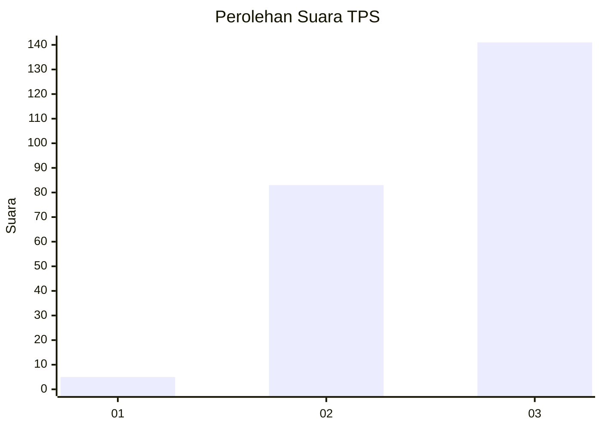
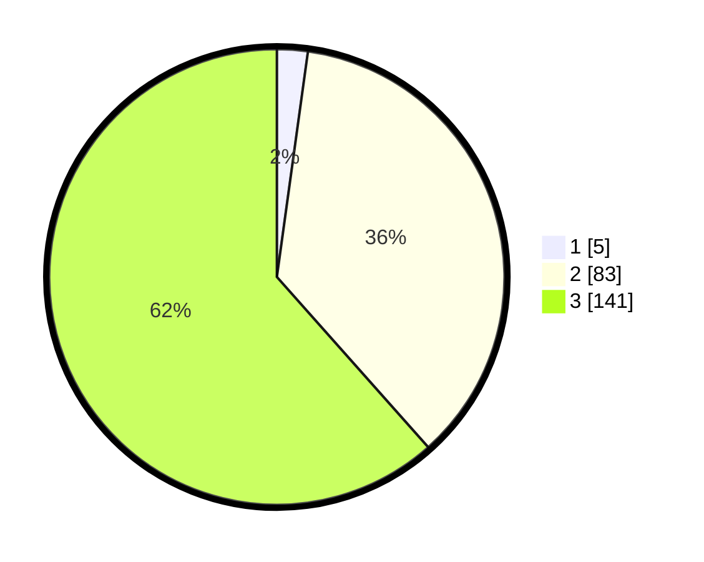

# Hasil

## Grafik

## Tabel

| No. | Nama Paslon    | Suara | Suara (raw) | Persentase |
|:--- |:-------------- | -----:| -----------:| ----------:|
| 1   | ANIES MUHAIMIN | 5     | [5][p-1]    | 2,18       |
| 2   | PRABOWO GIBRAN | 83    | [83][p-2]   | 36,24      |
| 3   | GANJAR MAHFUD  | 141   | [141][p-3]  | 61,57      |

[p-1]: https://github.com/gigit-pemilu/pemilu-2024-82-maluku-utara/blob/main/pilpres/hitung-suara/sub/82-maluku-utara/sub/08-pulau-taliabu/sub/07-taliabu-selatan/sub/2006-sumbong/sub/001-tps/sub/paslon-1.txt
[p-2]: https://github.com/gigit-pemilu/pemilu-2024-82-maluku-utara/blob/main/pilpres/hitung-suara/sub/82-maluku-utara/sub/08-pulau-taliabu/sub/07-taliabu-selatan/sub/2006-sumbong/sub/001-tps/sub/paslon-2.txt
[p-3]: https://github.com/gigit-pemilu/pemilu-2024-82-maluku-utara/blob/main/pilpres/hitung-suara/sub/82-maluku-utara/sub/08-pulau-taliabu/sub/07-taliabu-selatan/sub/2006-sumbong/sub/001-tps/sub/paslon-3.txt

## Foto C Plano

https://sirekap-obj-formc.kpu.go.id/7a1f/pemilu/ppwp/82/08/07/20/06/8208072006001-20240215-020119--92177de0-9205-4555-9042-54394148cd2e.jpg

https://sirekap-obj-formc.kpu.go.id/7a1f/pemilu/ppwp/82/08/07/20/06/8208072006001-20240215-020241--0189225e-ee37-40b3-9da3-0a4970acec67.jpg

https://sirekap-obj-formc.kpu.go.id/7a1f/pemilu/ppwp/82/08/07/20/06/8208072006001-20240215-020726--bbc392f8-c2a8-4bf3-8220-e5514afc3598.jpg

## Metadata

| Key        | Value               |
| ---------- | ------------------- |
| Time Stamp | 2024-02-15 19:30:26 |

