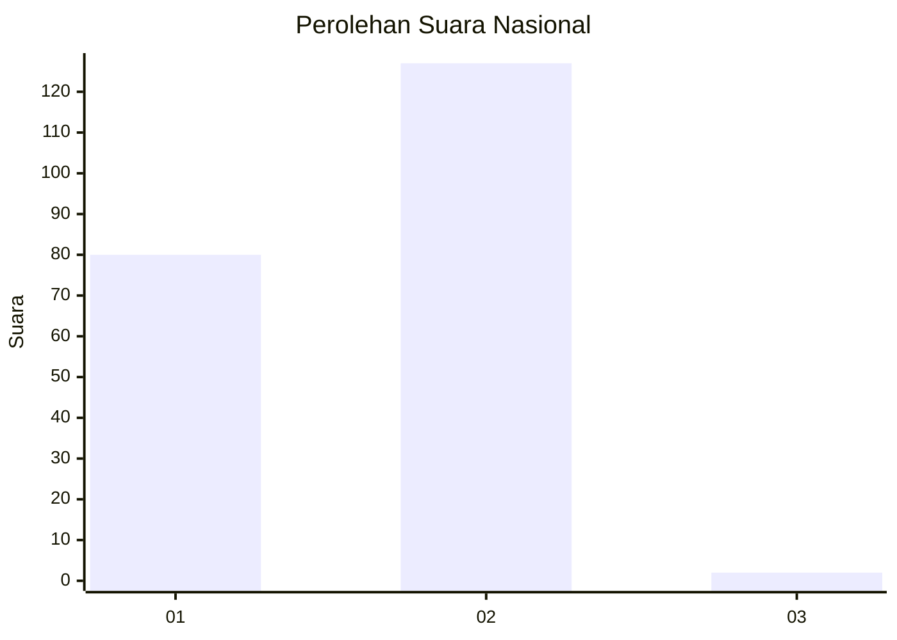
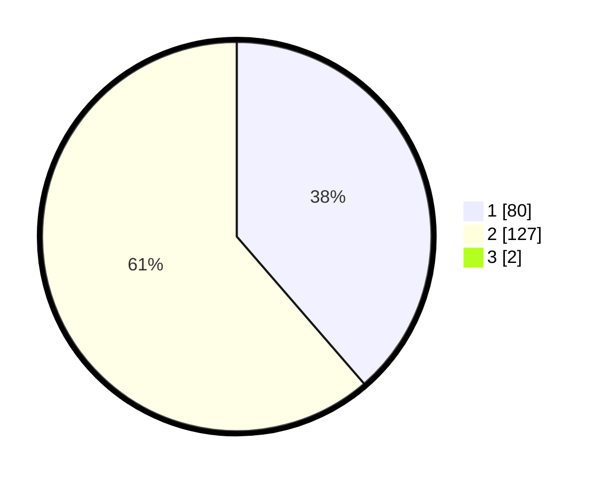

# Hasil

## Grafik

## Tabel

| No. | Nama Paslon    | Suara | Suara (raw) | Persentase |
|:--- |:-------------- | -----:| -----------:| ----------:|
| 1   | ANIES MUHAIMIN | 80    | [80][p-1]   | 38,28      |
| 2   | PRABOWO GIBRAN | 127   | [127][p-2]  | 60,77      |
| 3   | GANJAR MAHFUD  | 2     | [2][p-3]    | 0,96       |

[p-1]: https://github.com/gigit-pemilu/pemilu-2024/blob/main/pilpres/hitung-suara/sub/82-maluku-utara/sub/71-kota-ternate/sub/02-kota-ternate-selatan/sub/1021-mangga-dua-utara/sub/005-tps/sub/paslon-1.txt
[p-2]: https://github.com/gigit-pemilu/pemilu-2024/blob/main/pilpres/hitung-suara/sub/82-maluku-utara/sub/71-kota-ternate/sub/02-kota-ternate-selatan/sub/1021-mangga-dua-utara/sub/005-tps/sub/paslon-2.txt
[p-3]: https://github.com/gigit-pemilu/pemilu-2024/blob/main/pilpres/hitung-suara/sub/82-maluku-utara/sub/71-kota-ternate/sub/02-kota-ternate-selatan/sub/1021-mangga-dua-utara/sub/005-tps/sub/paslon-3.txt

## Foto C Plano

https://sirekap-obj-formc.kpu.go.id/ba89/pemilu/ppwp/82/71/02/10/21/8271021021005-20240215-001342--22e7bc4c-dc42-4da7-afd4-03c3d38f557b.jpg

https://sirekap-obj-formc.kpu.go.id/ba89/pemilu/ppwp/82/71/02/10/21/8271021021005-20240215-003450--cc37fd52-7e6d-4d3d-abb8-0e11e0fabe6d.jpg

https://sirekap-obj-formc.kpu.go.id/ba89/pemilu/ppwp/82/71/02/10/21/8271021021005-20240215-002652--62cba87c-f740-441c-b354-44a7cf31e3c2.jpg

## Metadata

| Key        | Value               |
| ---------- | ------------------- |
| Time Stamp | 2024-02-15 20:00:44 |

## DATA PEMILIH TETAP

Jumlah pemilih dalam DPT: **289**.
 * L: **124**.
 * P: **255**.

## DATA PENGGUNA HAK PILIH

Jumlah pengguna hak pilih dalam DPT: **209**.
 * L: **87**.
 * P: **122**.

Jumlah pengguna hak pilih dalam DPTb: **80**.
 * L: **800**.
 * P: **8**.

Jumlah pengguna hak pilih dalam DPK: **505**.
 * L: **7**.
 * P: **2**.

Jumlah pengguna hak pilih: **262**.
 * L: **88**.
 * P: **724**.

## JUMLAH SUARA SAH DAN TIDAK SAH

JUMLAH SELURUH SUARA SAH: **209**.

JUMLAH SUARA TIDAK SAH: **3**.

JUMLAH SELURUH SUARA SAH DAN SUARA TIDAK SAH: **212**.

