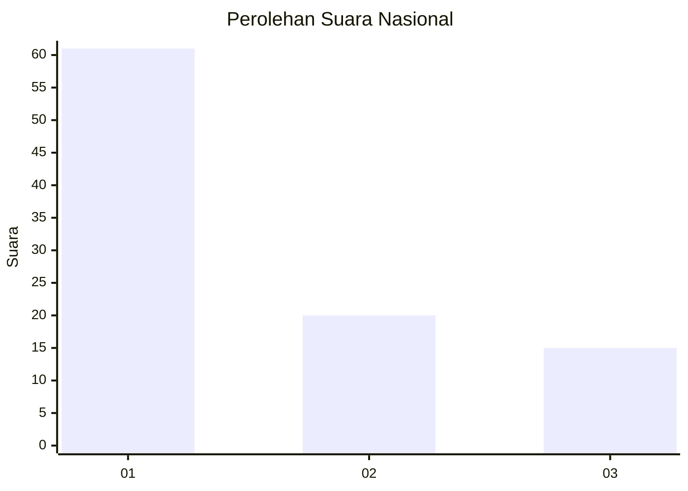
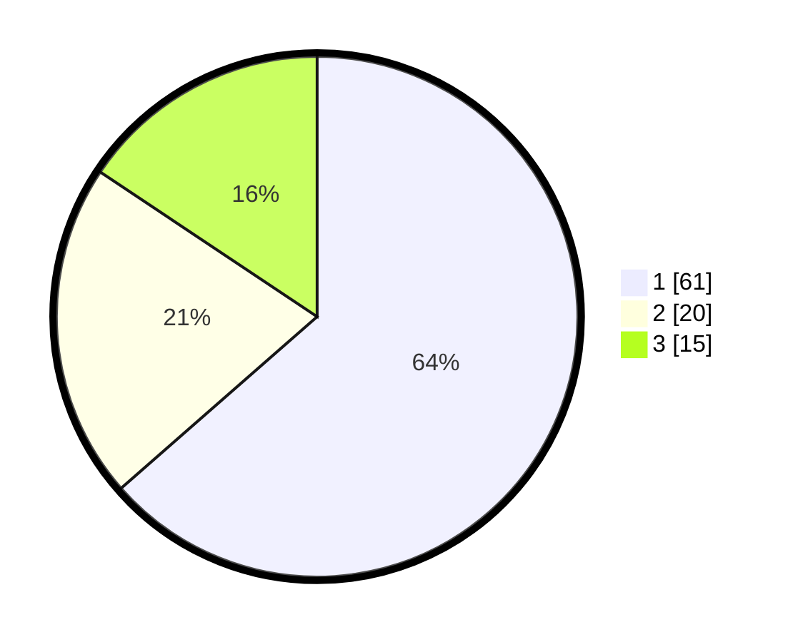

# Hasil

## Grafik

## Tabel

| No. | Nama Paslon    | Suara | Suara (raw) | Persentase |
|:--- |:-------------- | -----:| -----------:| ----------:|
| 1   | ANIES MUHAIMIN | 61    | [61][p-1]   | 63,54      |
| 2   | PRABOWO GIBRAN | 20    | [20][p-2]   | 20,83      |
| 3   | GANJAR MAHFUD  | 15    | [15][p-3]   | 15,63      |

[p-1]: https://github.com/gigit-pemilu/pemilu-2024/blob/main/pilpres/hitung-suara/sub/82-maluku-utara/sub/71-kota-ternate/sub/06-kota-ternate-tengah/sub/1008-kota-baru/sub/004-tps/sub/paslon-1.txt
[p-2]: https://github.com/gigit-pemilu/pemilu-2024/blob/main/pilpres/hitung-suara/sub/82-maluku-utara/sub/71-kota-ternate/sub/06-kota-ternate-tengah/sub/1008-kota-baru/sub/004-tps/sub/paslon-2.txt
[p-3]: https://github.com/gigit-pemilu/pemilu-2024/blob/main/pilpres/hitung-suara/sub/82-maluku-utara/sub/71-kota-ternate/sub/06-kota-ternate-tengah/sub/1008-kota-baru/sub/004-tps/sub/paslon-3.txt

## Foto C Plano

https://sirekap-obj-formc.kpu.go.id/f0c4/pemilu/ppwp/82/71/06/10/08/8271061008004-20240219-230435--9c383323-f2f7-43a6-9587-d76394aa0a1e.jpg

https://sirekap-obj-formc.kpu.go.id/f0c4/pemilu/ppwp/82/71/06/10/08/8271061008004-20240219-230505--24686306-829c-47a7-bbf6-cd82bbe525ec.jpg

https://sirekap-obj-formc.kpu.go.id/f0c4/pemilu/ppwp/82/71/06/10/08/8271061008004-20240219-230555--b489cd08-a0e0-4702-89d3-dadb76631f57.jpg

## Metadata

| Key        | Value               |
| ---------- | ------------------- |
| Time Stamp | 2024-02-20 00:00:00 |

## DATA PEMILIH TETAP

Jumlah pemilih dalam DPT: **275**.
 * L: **121**.
 * P: **145**.

## DATA PENGGUNA HAK PILIH

Jumlah pengguna hak pilih dalam DPT: **77**.
 * L: **550**.
 * P: **7**.

Jumlah pengguna hak pilih dalam DPTb: **41**.
 * L: **2**.
 * P: **401**.

Jumlah pengguna hak pilih dalam DPK: **0**.
 * L: **5**.
 * P: **2**.

Jumlah pengguna hak pilih: **114**.
 * L: **94**.
 * P: **407**.

## JUMLAH SUARA SAH DAN TIDAK SAH

JUMLAH SELURUH SUARA SAH: **197**.

JUMLAH SUARA TIDAK SAH: **0**.

JUMLAH SELURUH SUARA SAH DAN SUARA TIDAK SAH: **197**.

