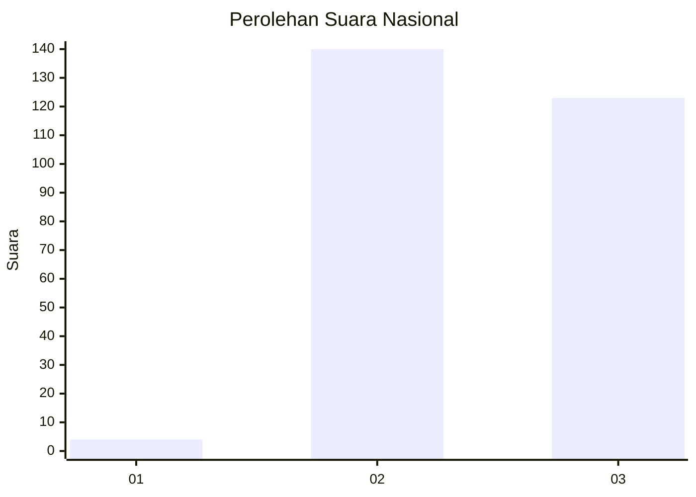
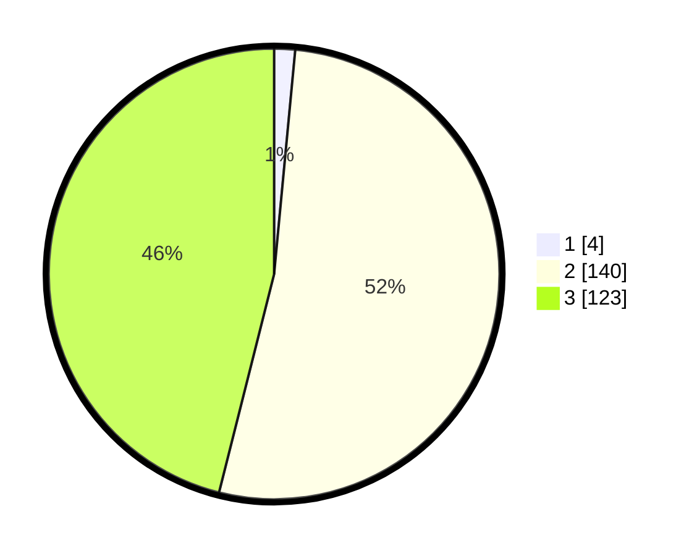

# Hasil

## Grafik

## Tabel

| No. | Nama Paslon    | Suara | Suara (raw) | Persentase |
|:--- |:-------------- | -----:| -----------:| ----------:|
| 1   | ANIES MUHAIMIN | 4     | [4][p-1]    | 1,50       |
| 2   | PRABOWO GIBRAN | 140   | [140][p-2]  | 52,43      |
| 3   | GANJAR MAHFUD  | 123   | [123][p-3]  | 46,07      |

[p-1]: https://github.com/gigit-pemilu/pemilu-2024/blob/main/pilpres/hitung-suara/sub/82-maluku-utara/sub/72-kota-tidore-kepulauan/sub/03-oba/sub/1004-payahe/sub/005-tps/sub/paslon-1.txt
[p-2]: https://github.com/gigit-pemilu/pemilu-2024/blob/main/pilpres/hitung-suara/sub/82-maluku-utara/sub/72-kota-tidore-kepulauan/sub/03-oba/sub/1004-payahe/sub/005-tps/sub/paslon-2.txt
[p-3]: https://github.com/gigit-pemilu/pemilu-2024/blob/main/pilpres/hitung-suara/sub/82-maluku-utara/sub/72-kota-tidore-kepulauan/sub/03-oba/sub/1004-payahe/sub/005-tps/sub/paslon-3.txt

## Foto C Plano

https://sirekap-obj-formc.kpu.go.id/ff71/pemilu/ppwp/82/72/03/10/04/8272031004005-20240215-164327--2c473564-78be-4917-bb26-9a6afc90ccb5.jpg

https://sirekap-obj-formc.kpu.go.id/ff71/pemilu/ppwp/82/72/03/10/04/8272031004005-20240215-170455--bc609a6f-c79e-456b-b6aa-f84acead73bb.jpg

https://sirekap-obj-formc.kpu.go.id/ff71/pemilu/ppwp/82/72/03/10/04/8272031004005-20240215-170705--034273f1-df5a-4ba6-a1cb-13c7d626918d.jpg

## Metadata

| Key        | Value               |
| ---------- | ------------------- |
| Time Stamp | 2024-02-15 20:30:46 |

